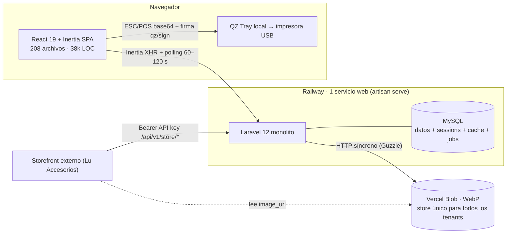
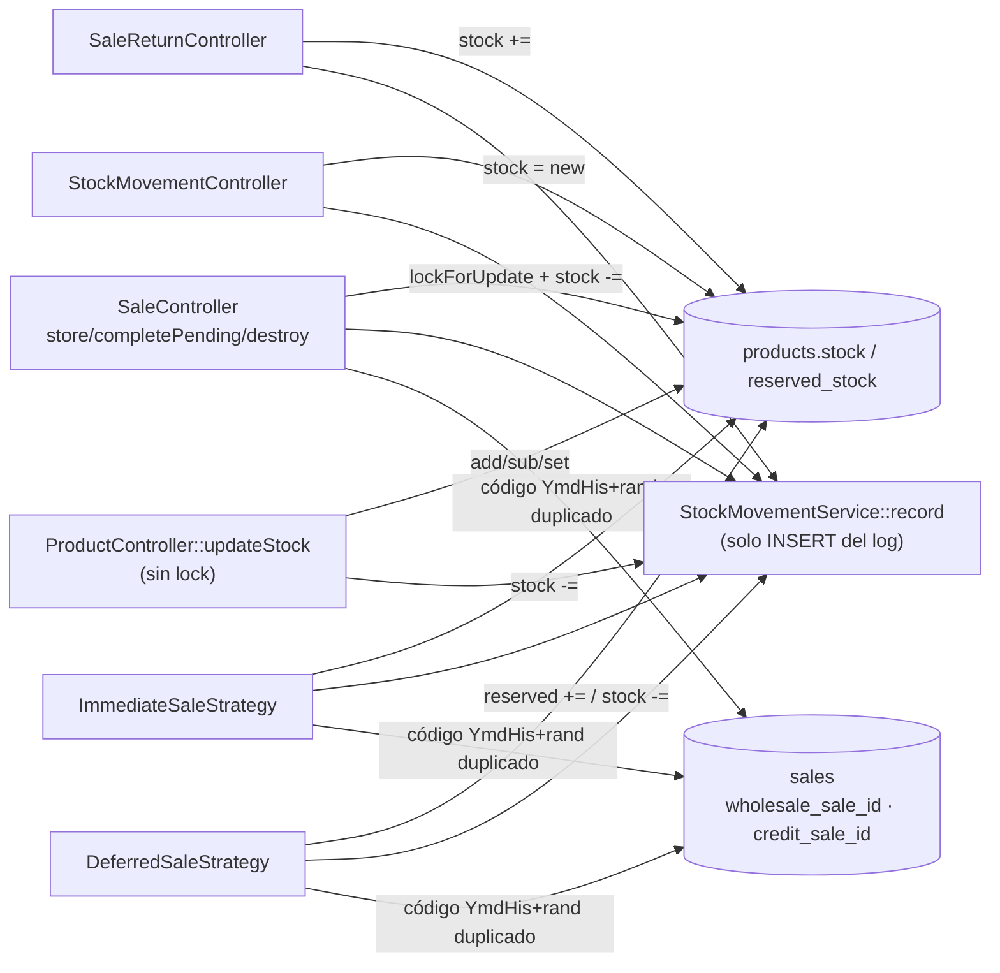
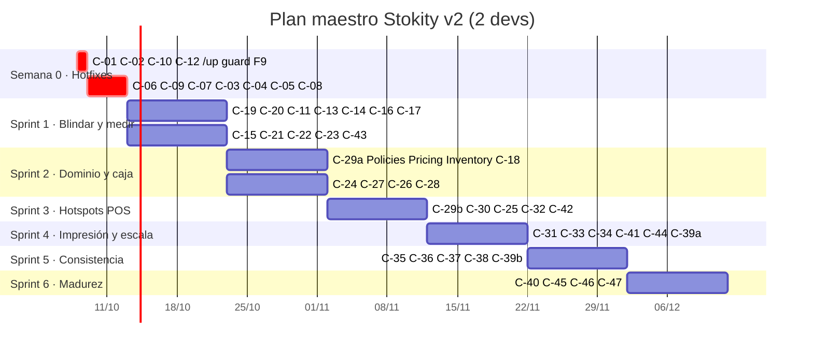
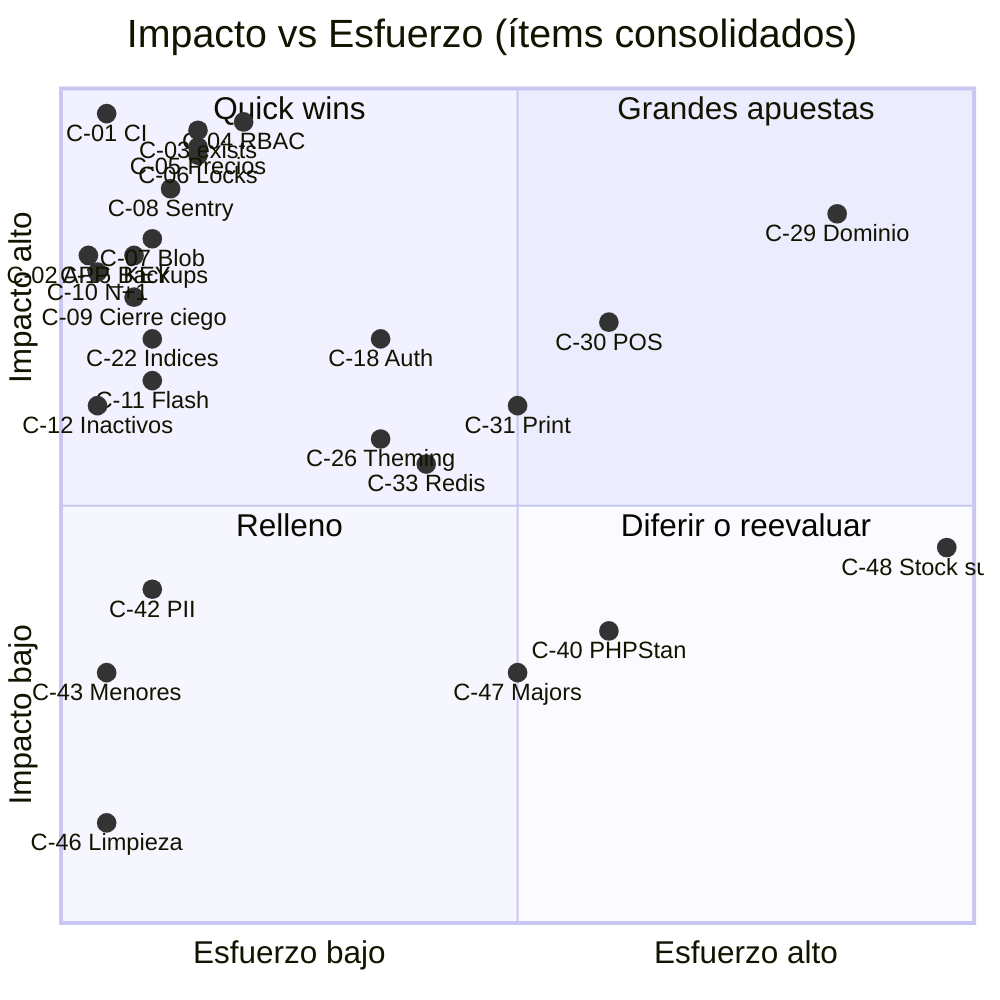
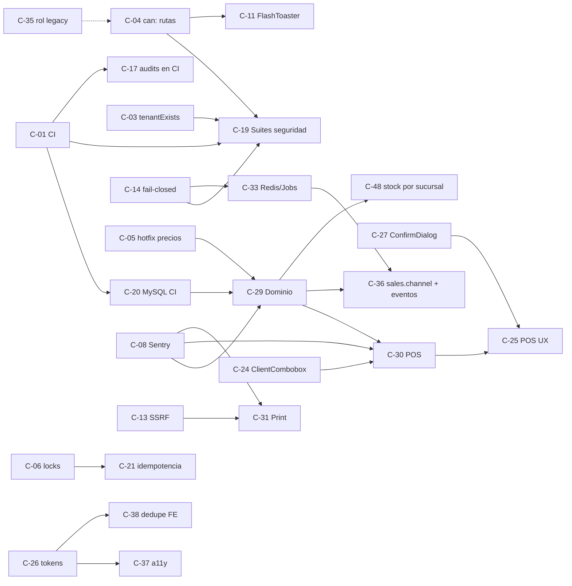

# DIAGNÓSTICO COMPLETO DE LA APLICACIÓN

> **Producto:** Stokity v2, POS SaaS multi-tenant (Laravel 12 · Inertia 2 · React 19 · TypeScript · Tailwind 4 · MySQL · Railway · Vercel Blob)
> **Fecha:** 2026-10-07 · **Commit auditado:** `4cf28d9` (`master`)
> **Método:** consolidación (fase 3) de 5 auditorías independientes de solo lectura. El coordinador verificó directamente en el código los hallazgos marcados con ✅.
> **Informes fuente (detalle completo):**
> [01 UI/UX](./01-ui-ux.md) · [02 Performance](./02-performance.md) · [03 Seguridad](./03-seguridad.md) · [04 Arquitectura](./04-arquitectura.md) · [05 Testing & Reliability](./05-testing-reliability.md)
>
> **Convención de IDs.** Los hallazgos de cada informe conservan su ID original: `UX-nn` (UI/UX), `B-n` (Performance), `VC/VA/VM/VB-nn` (Seguridad: crítica/alta/media/baja), `DT-nn` / `R-nn` (Arquitectura: deuda / refactor), `G-nn` (Testing). Los ítems consolidados del plan maestro usan `C-nn`.
> Este documento no contiene valores de secretos.

---

## 📌 RESUMEN EJECUTIVO

### Riesgo global: **ALTO** (7/10)

La base es sólida: el núcleo multi-tenant (`TenantManager` + `TenantScope` + `BelongsToTenant`), el catálogo RBAC, la API storefront y una suite de 475 tests Pest + 96 Vitest, todos en verde. Pero hay **tres causas raíz** detrás de la mayoría de los hallazgos de las cinco áreas:

1. **La regla de negocio vive en el lugar equivocado.** Precios, totales, permisos y control de stock se deciden en el navegador o en controladores gordos (`SaleController` 914 LOC, `PrintController` 1.640 LOC, `pos/index.tsx` 2.095 LOC), y no en una capa de dominio del servidor. De ahí vienen la manipulación de precios, el RBAC aplicado solo en la UI, la mutación de stock duplicada en 8 sitios y las condiciones de carrera.
2. **No hay red de seguridad automática en producción.** El CI nunca se ejecuta (los workflows escuchan `main`/`develop`; se despliega desde `master`) ✅. No hay monitoreo de errores, el healthcheck apunta a `/`, los backups no están programados ni probados y la suite corre en SQLite, así que no detecta carreras.
3. **Sistemas adoptados a medias.** El catálogo de permisos existe pero el backend no lo exige. shadcn/ui está instalado pero nunca se completó como sistema de diseño (sin tokens semánticos ni primitivas). La multitenancy es sólida en Eloquent pero *fail-open* fuera de él (`exists:` crudos, JOINs sin `tenant_id`, `TenantScope` no-op sin contexto).

### Top 10 problemas consolidados

| # | Ítem | Problema | Por qué importa | Fuentes |
|---|---|---|---|---|
| 1 | **C-01** | El CI nunca corre en `master` ✅. Cada push despliega sin pasar los 475 tests, PHPStan ni lint | Regresiones directas a producción en ventas, caja y créditos | DT-07/R1, G1, G17 |
| 2 | **C-04** | RBAC solo en la UI: sin `can:` en POS, ventas, devoluciones ✅, clientes, créditos, caja ni ajuste de stock. Además, `users.assign_role` no se exige (autoescalada a administrador) | Fraude interno (devoluciones ficticias, stock inflado), PII de clientes expuesta a roles sin permiso | VC-02, DT-01/R4, VA-07, UX-21 |
| 3 | **C-03** | Reglas `exists:` sin acotar al tenant ✅ (36 reglas) + JOINs crudos sin `tenant_id` | Fuga de nombre y email de usuarios de **cualquier** tenant, incluidos super-admins; FKs cruzadas que corrompen datos | VC-01, DT-03/R3, G7 |
| 4 | **C-05** | `price`, `subtotal`, `net` y `date` de la venta los decide el cliente; `pos.apply_discount`/`pos.sell_variable_price` no se aplican | Un vendedor puede vender a 1 COP o con fecha retroactiva | VC-04, DT-02/R5, G4, UX-19 |
| 5 | **C-06** | Doble envío y carreras en rutas de dinero: F9 ignora `submitting`, abono a crédito sin lock, `completePending` sin lock, `updateStock` sin lock | Ventas duplicadas, stock descontado 2×, caja descuadrada | UX-01, G2, G3, G5 (+ G12 → C-21) |
| 6 | **C-07** | `BlobStorageService::delete()` borra cualquier URL que contenga `vercel-storage.com` ✅ (store compartido) | Un tenant puede borrar imágenes de otro | VC-03 |
| 7 | **C-08 / C-16** | Producción sin monitoreo de errores (sin Sentry; logs en archivo efímero) y backups sin programar ni probar | Incidentes invisibles hasta que llama el cliente; riesgo de pérdida irreversible de datos | G8, G11, G15 |
| 8 | **C-02** | `APP_KEY` de `.env.example` idéntico al `.env` local ✅ (falta verificar producción) | Si producción comparte la clave: cookies y URLs firmadas falsificables | VC-06 |
| 9 | **C-09** | El cierre de caja "ciego" envía y muestra totales por método y movimientos | Se anula el control antifraude que el tenant activó a propósito | UX-02 |
| 10 | **C-10 / C-22** | N+1 sistémico (`Product::image_url` → caché en MySQL por producto: **67 queries por tecla** en la búsqueda del POS) e índices sin `tenant_id` al frente + 44 `whereDate` | Latencia en caja hoy y degradación de 10–50× al crecer los tenants (*noisy neighbour*) | B1, B3 |

### Salud por área

| Área | Salud (0–10, mayor es mejor) | Lectura | Informe |
|---|:---:|---|---|
| 🎨 UI/UX | **5,5** | Base shadcn/Radix correcta y buenos detalles (atajos, `CurrencyInput`); sin sistema de diseño (≈1.287 colores fijos, 0 tokens de estado), 5 problemas críticos de flujo (doble cobro, cierre ciego, feedback perdido, contraste de marca, carrito volátil) | [01](./01-ui-ux.md) |
| ⚡ Performance | **6** | Bien a la escala actual (CRUD < 20 queries, CLS bueno). Riesgo de escalado: N+1 del 90 % en la búsqueda del POS, índices no alineados con multitenancy, polling que recalcula todo, imágenes sin redimensionar | [02](./02-performance.md) |
| 🔒 Seguridad | **3,5** (riesgo 7/10) | Tenancy de Eloquent sólida y sin SQLi ni XSS; rotos el control de acceso (A01 = 9/10), la integridad de la venta y la superficie de Blob/SSRF. Con VC-01..06 corregidas, el riesgo bajaría a 3–4/10 | [03](./03-seguridad.md) |
| 🏗️ Arquitectura | **6** | Monolito modular con deuda moderada (SQALE B/C, ~9–11 %, ≈68 días-persona). Módulos nuevos limpios (Créditos, Store API); dominio de ventas, stock e impresión en controladores gordos | [04](./04-arquitectura.md) |
| ✅ Testing & Reliability | **4** | Suite de buena calidad y en verde, pero sin CI, sin monitoreo, sin backups probados, cobertura estimada ~45–55 % (impresión ~10 %, reportes ~25 %) y 0 E2E | [05](./05-testing-reliability.md) |
| **Global** | **≈ 5 / 10** | Producto funcional y bien encaminado; el riesgo está concentrado y se puede corregir en ~1 trimestre | — |

### Correlaciones clave entre áreas

| Tema transversal | Lo detectaron | Consolidado en |
|---|---|---|
| **El servidor confía en el cliente** (precio, subtotal, neto, fecha, descuento) | Seguridad VC-04 · Arquitectura DT-02 · Testing G4 · UX-19 (descuento > 100 %) · Performance B4 (`Product::find` por ítem) | C-05 → C-29 |
| **Permisos solo en la UI** | Seguridad VC-02/VA-07 · Arquitectura DT-01 (sin Policies, 72 `abort_if` de sucursal copiados) · UX-21 (UI atada a nombres de rol) · DT-11 (rol legacy) | C-04, C-35 |
| **`exists:` y JOINs sin tenant** | Seguridad VC-01/VB-20 · Arquitectura DT-03 · Testing G7 (aislamiento probado solo en `Product`) | C-03, C-19 |
| **Doble envío / idempotencia / concurrencia** | UX-01 (F9) · Testing G2/G3/G5/G12, G6 (SQLite no ve carreras, `PessimisticLockTest` da falsa confianza) · Performance B4 (ventana de locks larga) | C-06, C-20, C-21 |
| **CI que no corre** | Arquitectura DT-07 · Testing G1/G17 · Seguridad (audit/gitleaks en CI) · UX (axe en CI) · Performance (presupuestos en CI) | C-01 (todo lo demás depende de él) |
| **Contexto de tenant fail-open** | Seguridad VM-12/VM-11 · Arquitectura DT-10 (bloquea Jobs/scheduler futuros) | C-14 |
| **`PrintController` God Object** (1.640 LOC, CC 28) | Arquitectura DT-05 · Testing G13 (~10 % cobertura) · Seguridad VC-05 (SSRF en `downloadToTempFile`), VM-10 (`qz/sign` como oráculo), VB-20 (DoS por dimensiones) · bug abierto del corte superior del recibo | C-31, C-13, C-32 |
| **POS de 2.095 líneas / 45 `useState`** | UX-31 (origen de UX-01/05/06/08/13) · Performance B5 (INP 80–200 ms) · Arquitectura DT-08 (máximo churn: 31 commits) · Testing G14 (0 tests) | C-30, C-25 |
| **Caché, sesión y cola en MySQL** | Performance B1 (amplifica el N+1), B8 · Arquitectura DT-09 (sin tags → reportes desactualizados 15 min) · Testing G16 | C-10, C-33 |
| **Healthcheck en `/`, `artisan serve` y migraciones en el arranque** | Performance B11-g · Arquitectura DT-09 · Testing G9/G10 | C-15 |
| **Superficie de Vercel Blob** | Seguridad VC-03/VC-05 · Performance B9 (sin redimensionar, 200 KB–1,5 MB por miniatura; impacta al storefront) · Testing G16 (sin reintentos) | C-07, C-13, C-28 |
| **Payload global sobredimensionado** | Performance B6 (Ziggy = 49 % del payload base) · Seguridad VB-17 (Ziggy publica rutas `/admin/*` y `business` completo a invitados) · Arquitectura DT-15 | C-34 |
| **Selector de 500 clientes** | UX-09/UX-05 · Performance B5/B7 · Arquitectura DT-16 (el cliente 501 no se puede seleccionar) | C-24 |
| **Dependencias vulnerables** | Seguridad VM-14 (Guzzle *host bypass* agrava VC-05) · Arquitectura DT-18 (52 avisos Composer, 16 npm) | C-17 |

**Esfuerzo total consolidado:** ≈ **104 días-persona** accionables (+13 d del ítem estratégico de stock por sucursal). Con 2 desarrolladores son ≈ 13 semanas (un trimestre). Las 9 críticas suman ≈ 9,5 días y se pueden cerrar en las dos primeras semanas.

---

## 🎨 REPORTE AGENTE UI/UX

> Condensado de [01-ui-ux.md](./01-ui-ux.md). Revisión estática de `resources/js` (≈38k líneas), contrastes calculados con WCAG 2.1.

### Estado Actual

**Stack:** Tailwind 4 + shadcn/ui (Radix) + tokens OKLCH, tema claro/oscuro, color de marca por tenant inyectado en runtime (`components/brand-colors.tsx`), `react-hot-toast`, `react-date-range`.

**A conservar:** `CurrencyInput` (es-CO, `inputMode="numeric"`), atajos del POS (`/`, Enter, Esc, F9, `?`), tab bar móvil con *safe-area*, vistas en tarjetas para móvil en 28 páginas, `useScrollToError`, `credits/show.tsx` como modelo de `Dialog` bien hecho.

| Indicador de deuda de diseño | Valor |
|---|---|
| Clases de paleta Tailwind hardcodeadas | **≈1.287** (0 tokens semánticos de estado) |
| Usos de `dark:` en páginas | 1.018 |
| `text-[9px]`/`[10px]`/`[11px]` | 118 |
| Modales caseros `fixed inset-0` | 10 (6 en el POS) |
| `confirm()` nativo | 4 (contradice la regla del proyecto) |
| `<Link><Button>` sin `asChild` | 57 |
| `Button size="icon"` con `aria-label` | 0 de 44 |
| Formateadores de moneda locales | 20 |
| Soporte de `prefers-reduced-motion` | 0 |
| Páginas > 700 líneas | 8 (`pos/index.tsx` = 2.095, ~45 `useState`) |

**Diagnóstico de raíz:** shadcn/ui adoptado pero no completado como sistema de diseño. Faltan (1) tokens semánticos y un *foreground* de marca calculado por contraste, (2) primitivas compuestas (ConfirmDialog, FormField, StatusBadge, PageHeader, Combobox, IconButton) y (3) un canal global de feedback (flash → toast).

### Problemas Identificados

| ID | Problema | Ref. | Prioridad | Esfuerzo | → |
|---|---|---|---|---|---|
| UX-01 | F9 puede registrar la venta dos veces (el atajo ignora `submitting`) | `pos/index.tsx:599, :796` | **Crítica** | 1 h | C-06 |
| UX-02 | El cierre ciego deja ver el efectivo esperado (totales por método, movimientos y abonos siempre visibles y enviados en props) | `cash-sessions/close.tsx:95-175` | **Crítica** | 3–4 h | C-09 |
| UX-03 | `flash('error')` nunca llega al frontend; `success` solo se muestra en 8 de 26 controladores | `HandleInertiaRequests.php:65-71` | **Crítica** | 4–6 h | C-11 |
| UX-04 | Color de marca sin validación de contraste (texto blanco fijo en ≥21 sitios; iconos a ≈1,7:1 en oscuro) | `brand-colors.tsx`, `settings/appearance.tsx:105-130` | **Crítica** | 1 d | C-26 |
| UX-05 | Pérdida silenciosa del carrito (sin persistencia, sin aviso al navegar, sin alta de cliente desde el POS) | `pos:322, :181, :1140` | **Crítica** | 1–1,5 d | C-25 |
| UX-06 | Modales caseros sin `role="dialog"`, foco atrapado ni Escape; F9 sigue activo con un modal abierto | `pos:1107-1955`, `admin/tenants/show.tsx` | Alta | 1 d | C-27 |
| UX-07 | `confirm()` nativo en acciones destructivas | `pos:1555, :1940`, `suppliers/show.tsx:58`, `finances/index.tsx:394` | Alta | 2–3 h | C-27 |
| UX-08 | Escáner/Enter agrega un resultado obsoleto o nada (debounce + `results[0]`) | `pos:478, :791` | Alta | 4–6 h | C-25 |
| UX-09 | Selector de cliente sin búsqueda (Radix `Select` con todos los clientes) | `pos:1523`, `sales/create.tsx:493`, `WholesaleOrderForm.tsx:151` | Alta | 1 d | C-24 |
| UX-10 | Sistema de color fragmentado (púrpura heredado, focos naranjas, 4 definiciones de badges) | 12 archivos | Alta | 2–3 d | C-26 |
| UX-11 | Foco visible insuficiente (`--ring` ≈1,2:1; 43 `focus:outline-none`) | `app.css` | Alta | 4 h | C-26 |
| UX-12 | Contraste insuficiente en acciones de dinero (ámbar 2,1:1, verde 2,3:1) | `pos:1933, :1248, :694` | Alta | 4 h | C-26 |
| UX-13 | El vuelto solo aparece en un toast de 6 s | `pos:620-652` | Alta | 4–6 h | C-25 |
| UX-14 | Altura del POS con número mágico `calc(100dvh-64px)`: "Cobrar" fuera de pantalla en 1366×768 | `pos:1301` | Alta | 2–3 h | C-25 |
| UX-15..18 | Microtipografía; `PageHeader`/`h1` inconsistentes; interactivos anidados y botones-icono sin nombre; errores de formulario sin asociar | global | Media | 4 h–2 d c/u | C-37 |
| UX-19 | El descuento % acepta > 100 (venta en $0) | `pos:1686` | Media | 2 h | C-05 |
| UX-20 | "Cargar cotización" sobrescribe el carrito sin avisar | `pos:874-890` | Media | 2 h | C-25 |
| UX-21 | UI atada a nombres de rol (`'vendedor'`) o a `branches.length` en vez de permisos | `branches/*`, `expenses/*`, `finances` | Media | 3–4 h | C-35 |
| UX-22 | Cierre de caja: el desglose por denominación no se sincroniza y no hay confirmación | `close.tsx:56, :255` | Media | 4 h | C-44 |
| UX-23/24 | Sin `prefers-reduced-motion` (orbes con blur de 110 px); login con `tabIndex` positivos y `status` en rojo | auth/welcome | Media | 2–3 h c/u | C-37 |
| UX-25 | Sidebar plano de 17 ítems, POS en 7.º lugar | `app-sidebar.tsx:39-226` | Media | 4–6 h | C-44 |
| UX-26..30 | Toaster sin tema oscuro; 20 formateadores de moneda; dependencias redundantes (Headless UI, `react-date-range`); gráfico escalado por % del total; huecos de modo oscuro | global | Baja | 1 h–1 d | C-37, C-38, C-34, C-43, C-26 |
| UX-31 | Páginas monolíticas (POS 2.095, `sales/create` 973, `settings/ticket` 809) | — | Habilitador | ver roadmap | C-30 |

### Recomendaciones

1. **Completar el sistema de diseño:** tokens `--success|warning|info|danger` (+ `-foreground`/`-soft`) en claro y oscuro; `--brand-foreground` y `--brand-on-dark` calculados por luminancia en `BrandColors`; `lib/format.ts` y `lib/status.ts` como fuente única; reglas de lint contra `confirm`, `text-[<12px]`, `bg-(purple|orange)-*` y `<Link><Button>` sin `asChild`.
2. **POS (velocidad y seguridad de la transacción):** guardas de envío, carrito persistente en `sessionStorage` con aviso al salir, Enter/escáner deterministas con coincidencia exacta por código, tarjeta persistente de "Última venta" con el cambio en grande, altura fluida y `ClientCombobox` con alta rápida.
3. **Feedback coherente:** `FlashToaster` global, `ConfirmDialog` + `useConfirm()` únicos, `FormField` con IDs y ARIA automáticos.
4. **WCAG 2.1 AA sistemático:** corregir en las primitivas (Dialog/Sheet, FormField, IconButton, paginación y tabla) y validar con `@axe-core/react` en desarrollo y axe en CI.
5. **Theming multi-tenant seguro:** vista previa real en `/settings/appearance` con indicador AA y validación en backend.

**Componentes clave a crear o refactorizar:** `confirm-dialog.tsx`, `combobox.tsx` + `ClientCombobox`, `form-field.tsx`, `status-badge.tsx`, `page-header.tsx`, `icon-button.tsx`, `flash-toaster.tsx`; división de `pos/index.tsx` en `ProductSearch`, `CartList`, `PaymentPanel`, `LastSaleCard`, `PendingSalesSheet` y diálogos, con `useReducer` + `usePersistentCart`.

### Roadmap

| Fase | Contenido | Esfuerzo | Resultado |
|---|---|---|---|
| 0 · Riesgo de negocio (sem. 1) | UX-01, UX-02, UX-03, UX-07, UX-12, UX-19, UX-14 | 3–4 d | Sin ventas duplicadas, sin fuga del cierre ciego ni fallos silenciosos |
| 1 · Fundaciones (sem. 2–3) | Tokens + marca con contraste (UX-04/10/11), primitivas, `lib/format`/`lib/status`, lint + axe en desarrollo | 6–8 d | Cada página nueva nace consistente y accesible |
| 2 · Refactor del POS (sem. 3–4) | División + `useReducer` + carrito persistente (UX-05/31), escáner (UX-08), combobox (UX-09), `LastSaleCard` (UX-13), Dialog/Sheet (UX-06), tests Vitest + Playwright "doble F9" | 5–6 d | POS rápido, sin pérdidas de carrito ni errores de cobro |
| 3 · Migración y pulido (sem. 5–6) | Codemods a tokens y primitivas, sidebar agrupado, cierre de caja, roles en UI, auth, toaster, `react-date-range` → `Calendar` | 5 d | Consistencia visual global |
| 4 · Gobernanza | axe en CI (0 *serious/critical*), regresión visual con 2 colores de marca extremos, checklist de PR | continua | — |

**KPIs:** tiempo medio por venta −20 %, ventas duplicadas/día = 0, diferencias de cierre por turno, tickets de soporte "no pasó nada", violaciones axe = 0 en 6 pantallas críticas.

---

## ⚡ REPORTE AGENTE PERFORMANCE

> Condensado de [02-performance.md](./02-performance.md). `npm run build` real + harness PHP local con `DB::enableQueryLog()` y `EXPLAIN` sobre la DB local (~100 productos/ventas). Lo relevante es el **nº de queries y su crecimiento con N**, no los milisegundos absolutos.

### Métricas Actuales

**Bundle (build de producción):** 1,98 MB raw / **564 KB gz** en 176 archivos. Entry `app` 110 KB gz; `app-layout` 45 KB gz.

| Ruta | JS gz primera carga |
|---|---|
| `auth/login` | 121 KB |
| `dashboard` | 179 KB |
| `pos/index` | 191 KB |
| `sales/index` | **232 KB** (incluye date-fns completo vía `react-date-range`, ~40 KB gz de más) |

**Coste por petición (backend):**

| Petición | Queries | Bytes | Nota |
|---|---|---|---|
| `GET /api/products/search?q=a` (cada tecla del POS) | **67** | 16 KB | N+1 de caché (B1) |
| `GET /stock-movements` | **125–132** (116 son `select * from cache`) | 108–128 KB | |
| `GET /dashboard` parcial `only=metrics` (polling) | **23** | **385 B** | recalcula todo para devolver una prop |
| `GET /credits` | 8–14 **+ un `UPDATE`** | 27–48 KB | escritura en un GET, también cada 60 s por polling |
| `GET /pos` | 10 | 50 KB | |
| Base por petición autenticada | 6–8 | ≈47 KB | 23,1 KB son Ziggy (sin SSR desplegado) |

**Base de datos:** índices compuestos creados antes de la multitenancy (ninguno empieza por `tenant_id`). `EXPLAIN` = `type=ALL` + `Using filesort` en agregados del dashboard, en el listado de ventas y en el storefront. **44 `whereDate()` no sargables.** Caché, sesión y cola usan el driver `database`.

**Core Web Vitals (estimados, sin RUM):** LCP 0,9–1,3 s en escritorio y **~2,2–3,0 s en móvil 4G** (100 % CSR, fuentes externas bloqueantes). **INP del POS 80–200 ms** por tecla en hardware de gama baja (componente monolítico + Select con 500 `SelectItem` montados aunque esté cerrado). CLS 0,02–0,06 (bueno).

**Frontend:** 16 páginas con polling cada 60–120 s sin backoff; 82 páginas con layout no persistente (remontan sidebar y Toaster en cada navegación); 0 de 22 `` con `loading="lazy"`; imágenes subidas **sin redimensionar** (una foto de 4000×3000 se sirve como miniatura de 40 px).

### Bottlenecks Detectados

| ID | Bottleneck | Ref. | Impacto medido / estimado | Prioridad | Esfuerzo | → |
|---|---|---|---|---|---|---|
| B1 | N+1 sistémico: `Product::image_url` llama a `BusinessSetting::getSettings()` → 1 SELECT a la caché en MySQL **por producto**, + `file_exists` | `Product.php:98, :236, :245` | 67 queries por tecla en el POS; 116/132 en stock-movements; +25–60 ms por búsqueda en Railway; afecta también a la Store API | **Crítica** | 1–2 h | C-10 |
| B2 | Props eager + polling: los reloads parciales recalculan todo; `/credits` hace `UPDATE` en cada GET | `DashboardController:30-121`, `CreditSaleController:37-41` | ~2.000–3.500 queries/min solo de polling con 50 tenants × 3 cajeros | Alta | 3–5 h | C-23 |
| B3 | Índices sin `tenant_id` al frente + 44 `whereDate` | migración `2026_03_21_*`, `ReportQueryService:878-882` | Tenant de 100 k ventas: 100–400 ms por agregado frente a < 5 ms; *noisy neighbour* | Alta (Crítica a medio plazo) | 4–6 h | C-22 |
| B4 | Venta: ~6 queries por ítem + recarga completa del POS | `SaleController:136, :880` | 5 ítems ≈ 45 queries + 10 de recarga; locks largos; +60–120 ms por venta | Alta | 4–6 h | C-29 |
| B5 | INP del POS: componente monolítico + Select de 500 clientes siempre renderizado | `pos/index.tsx:317, :1528` | 80–200 ms por tecla | Alta | 1–2 d | C-24, C-30 |
| B6 | Ziggy duplicado (23 KB × 2), `auth.user` completo, `quote` en cada request | `HandleInertiaRequests.php:47-60`, `app.blade.php:42` | 49 % del payload base | Media | 1–2 h | C-34 |
| B7 | Listas sin límite (`Product::...->get()` para un filtro; stock bajo sin límite; clientes completos) | `StockMovementController:74`, `DashboardController:299`, `PosController:24` | 5.000 productos ≈ 5 MB de JSON; el cliente 501 no se puede seleccionar | Alta | 4–8 h | C-24 |
| B8 | Caché, sesión y cola sobre MySQL; healthcheck en `/` | `.env.example`, `railway.toml` | ~3 de 6–8 queries base; `UPDATE sessions` por request | Media (Alta con más tenants) | 2–4 h + servicio | C-33, C-15 |
| B9 | Imágenes sin redimensionar ni lazy | `BlobStorageService.php:89-122` | Miniaturas de 200 KB–1,5 MB; hasta 10–40 MB por búsqueda; impacta al LCP del storefront | Alta | 1 d | C-28 |
| B10 | Bundle: date-fns completo, sin `manualChunks` (cada deploy invalida el vendor), fuentes bloqueantes | `sales/index.tsx:21-24`, `vite.config.ts` | +40 KB gz; ~155 KB gz re-descargados por deploy | Media | 3–5 h | C-34 |
| B11 | Menores: (a) N+1 en el cierre de caja; (b) caché de reportes sin invalidar + polling inútil; (c) layouts no persistentes; (d) `throttle:60,1` en la búsqueda (429 con escáner); (e) LIKE `%q%` sin atajo por código; (f) `useAppearance` quita el listener global; (g) healthcheck `/`; (h) agregados del dashboard sin `deleted_at` | varios | — | Media/Baja | 10 min–4 h | C-43, C-33, C-34, C-25, C-15 |

### Optimizaciones Propuestas

| # | Optimización | Ganancia estimada | Esfuerzo |
|---|---|---|---|
| 1 | Memo por petición de `BusinessSetting` (por `tenantId`, reseteado en `TenantManager::forget()`) + quitar `file_exists` | Búsqueda del POS **67 → ~7 queries (−90 %)**; stock-movements **132 → ~16** | 1–2 h |
| 2 | Índices compuestos `tenant_id`-first (`sales(tenant_id,status,date)`, `sales(tenant_id,created_at)`, `products(tenant_id,status,name)`, `cash_sessions(...)`, `credit_sales(...)`…) + rangos en lugar de `whereDate` | **10–50×** en agregados con 100 k ventas | 4–6 h |
| 3 | Props en closures/`Inertia::optional` + polling con backoff y sin solapamientos + `overdue` a un comando programado | Polling del dashboard 23 → ~9 queries; −50/−80 % de peticiones de polling | 3–5 h |
| 4 | Venta en lote: un `SELECT … FOR UPDATE` ordenado + inserts masivos + respuesta parcial | 5 ítems: **~45 → ~15 queries**; −60–120 ms por venta | 4–6 h |
| 5 | Higiene de payload y bundle: quitar el prop `ziggy`, lazy de `react-date-range`, `manualChunks`, imágenes 1600/320 px + `lazy` | −23 KB por navegación; `sales/index` −40 KB gz; miniaturas −90/−98 %; LCP móvil ~2,6 → ~1,9 s | 1,5–2 d |

### Roadmap

| Sprint | Contenido |
|---|---|
| 0 · Quick wins (≤ 1 d) | B1 + test de conteo de queries; props en closures; `overdue` programado; quitar `ziggy`/`quote`; `auth.user` explícito; B11-a/d/f/g/h; `react-date-range` lazy |
| 1 · DB y venta (1 sem.) | B3 (índices + `whereDate`, validado con `EXPLAIN` sobre un seed de 100 k); B4 venta en lote + tests de concurrencia; B7 `/api/clients/search`; B11-b invalidación de reportes |
| 2 · Frontend y caja (1–2 sem.) | B5 refactor del POS + combobox virtualizado + `useDeferredValue`; layouts persistentes; `manualChunks` + fuentes auto-hospedadas; `usePolling` con backoff |
| 3 · Infra y observabilidad (1 sem.) | B8 Redis + worker + jobs (Blob, PDF); B9 pipeline de imágenes + backfill; Pulse/Telescope, `preventLazyLoading`, RUM `web-vitals`; presupuestos en CI |

**KPIs objetivo:** búsqueda POS 67 → ≤ 8 queries · stock-movements 132 → ≤ 15 · venta de 5 ítems ~45 → ≤ 18 · tick de polling 23 → ≤ 10 · payload base 47 → ≤ 25 KB · `sales/index` 232 → ≤ 190 KB gz · LCP p75 móvil ≤ 2,0 s · INP POS < 100 ms · miniatura ≤ 20 KB.

---

## 🔒 REPORTE AGENTE SEGURIDAD

> Condensado de [03-seguridad.md](./03-seguridad.md). Análisis estático + `route:list`, `composer audit`, `npm audit`. Sin peticiones a producción. **Riesgo global: 7/10 → 3–4/10 tras corregir VC-01..06.**

### Vulnerabilidades Críticas

| ID | Vulnerabilidad | Archivos clave | Impacto | Prioridad | Esfuerzo | → |
|---|---|---|---|---|---|---|
| **VC-01** ✅ | Fuga entre tenants: `exists:` sin tenant + JOIN a `users`/`branches` sin `tenant_id` | `SaleController.php:122-124, :745-747`; `ReportQueryService.php:203, :497`; mismo patrón en ~13 archivos más | Enumeración de nombre y **email de cualquier usuario de la plataforma, incluidos super-admins** (vía `seller_id` + reporte de vendedores); FKs cruzadas que corrompen datos | **Crítica** | 1–1,5 d | C-03 |
| **VC-02** ✅ | RBAC solo en la interfaz: sin `can:` en clientes, ventas, POS, devoluciones, créditos, caja, dashboard; `POST /stock-movements` solo exige `view`; subpermisos y exports de reportes no se exigen | `routes/{clients,sales,credits,cash-sessions,stock-movements,reports}.php` | Un rol "Bodeguero" puede borrar clientes, devolver mercancía, registrar abonos e inflar el stock; PII expuesta (Ley 1581) | **Crítica** | 1–2 d | C-04 |
| **VC-03** ✅ | Borrado de blobs de otros tenants: `delete()` filtra por `str_contains('vercel-storage.com')` con un token maestro único | `BlobStorageService.php:63-66`; `BusinessSettingController.php:37, :47-54`; `StoreProductController.php:150` | Destrucción de activos entre tenants (vía `logo_url` libre o la API storefront) | **Crítica** | 0,5–1 d | C-07 |
| **VC-04** | Precio, total y fecha definidos por el cliente; `pos.apply_discount`/`pos.sell_variable_price` no se aplican | `SaleController.php:118-192, :323, :441`; `CreditSaleController.php:141-143` | Venta de 500.000 COP registrada en 0–1 COP, con stock descontado y fecha retroactiva | **Alta** (Crítica para el negocio) | 1 d | C-05 |
| **VC-05** | SSRF: `logo_url` sin filtro (descargado con `curl` + `FOLLOWLOCATION` en cada recibo); `ExistingHttpsBlobUrl` evadible (redirecciones, `[::1]`, IPs decimales, DNS); el status remoto actúa como oráculo | `PrintController.php:772-806, :1310-1350`; `Rules/ExistingHttpsBlobUrl.php:52-80` | Reconocimiento de la red interna de Railway (`*.railway.internal`) | **Alta** | 0,5–1 d | C-13 |
| **VC-06** ✅ | `APP_KEY` real en `.env.example`, igual al `.env` local (producción sin verificar) | `.env.example:3` | Si producción comparte la clave: falsificación de cookies cifradas y URLs firmadas | **Alta** (Crítica si coincide) | 1–2 h | C-02 |

### Riesgos Identificados

**Otras vulnerabilidades:**

| ID | Hallazgo | Prioridad | Esfuerzo | → |
|---|---|---|---|---|
| VA-07 | Escalada de rol: `users.assign_role` no se exige; un usuario puede asignarse `administrador` | Alta | 2–3 h | C-04 |
| VA-08 | Usuarios desactivados conservan la sesión y la cookie "recordarme" | Alta | 2 h | C-12 |
| VA-09 | `TrustProxies ['*']` → IP falsificable → se salta el rate-limit del login; sin límite global ni 2FA para super-admin | Alta | 3–4 h (+1–2 d 2FA) | C-18 |
| VM-10 | `qz/sign` firma cualquier payload para cualquier usuario autenticado con un certificado único de plataforma → control silencioso del QZ Tray de otros clientes | Media | 0,5 d (+2–3 d certificados por tenant) | C-32 |
| VM-11 | Filtro de sucursal *fail-open* si `branch_id` es NULL | Media | 1–2 h | C-14 |
| VM-12 | Contexto sin tenant *fail-open* (`TenantScope` no-op; `IdentifyTenant` deja pasar a un usuario sin tenant) | Media | 2 h | C-14 |
| VM-13 | Sin cabeceras de seguridad (CSP, HSTS, XFO, nosniff, Referrer-Policy) | Media | 0,5 d | C-18 |
| VM-14 | Dependencias con avisos: Guzzle (*host bypass*), PSR-7, `laravel/framework` (CRLF, *signed URL path confusion*), dompdf (lectura de archivos locales), commonmark; npm 16 (2 críticas) | Media | 0,5 d + QA | C-17 |
| VM-15 | Fotos de usuarios reales y de productos commiteadas en `public/uploads` | Media | 1 h | C-42 |
| VB-16 | Inyección de fórmulas en exports CSV/Excel | Baja | 30 min | C-42 |
| VB-17 | Ziggy completo (incluido `/admin/*`) y `business` completo servidos a invitados | Baja | 1–2 h | C-34 |
| VB-18 | Storefront API: rate-limit por hash de token (las keys inválidas no comparten contador), CORS `*` | Baja | 2 h | C-45 |
| VB-19 | Suplantación: las acciones quedan a nombre del suplantado; sin caducidad corta | Baja | 0,5 d | C-45 |
| VB-20 | `leftJoin` sin tenant en `SaleController::index`; endpoint de depuración `/users/relationships/definitive`; `imagecreatefromstring` sin límite de dimensiones (DoS); `qz/sign` por GET | Baja | 1–3 h | C-03, C-42, C-28, C-32 |

**Matriz OWASP (2021), puntuación de riesgo 1–10:**

| Área | Riesgo | Hallazgos |
|---|:---:|---|
| A01 Control de acceso roto | **9** | VC-01, VC-02, VC-03, VA-07, VM-11, VM-12 |
| A02 Criptografía / secretos | 7 | VC-06, VM-10 |
| A04 Diseño inseguro | 7 | VC-04, VB-18 |
| A05 Configuración / A06 Componentes / A07 Autenticación / A10 SSRF | 6 | VA-09, VM-13, VB-17 / VM-14 / VA-08, VA-09, VB-19 / VC-05 |
| Protección de datos personales | 6 | VC-02, VM-15, VC-01 |
| A08 Integridad | 5 | VC-03, VC-01 |
| A03 Inyección · XSS · CSRF | 3 · 2 · 2 | Sin SQLi (todo con bindings), sin sinks de XSS, CSRF correcto |

**Controles verificados como correctos:** `tenant_id` fuera de `$fillable`; `IdentifyTenant` antes de `SubstituteBindings`; `Role` protegido con `authorizeSameTenant()`; API keys en SHA-256 con scopes opt-in; suplantación con contraseña, log y sin anidamiento; regeneración de sesión en login y logout; recodificación WebP de las subidas.

### Acciones Inmediatas

*(próximas 48–72 h, en este orden)*

1. **Verificar `APP_KEY` de producción** frente a `.env.example` sin imprimirlo; si coincide, rotarlo con `APP_PREVIOUS_KEYS`. Vaciar `APP_KEY` en `.env.example` (VC-06). *1 h*
2. **Helper `tenantExists()`** en todas las reglas `exists:` + `tenant_id` en los JOINs de `ReportQueryService`; ejecutar en producción la consulta de auditoría de FKs cruzadas (solo lectura) (VC-01). *1 d*
3. **`can:` en rutas** de clientes, ventas, devoluciones, créditos, caja, POS, dashboard, `stock-movements.store` y exports de reportes; probar con los 3 roles por defecto (VC-02). *1–2 d*
4. **Restringir `BlobStorageService::delete()`** a host exacto + prefijo por tenant; eliminar el `logo_url` libre (VC-03). *0,5 d*
5. **Exigir `users.assign_role`** y prohibir cambiar el propio rol (VA-07). *2 h*
6. **Middleware `EnsureUserIsActive`** + borrar sesiones al desactivar (VA-08). *2 h*
7. **Recalcular precios y totales en el servidor** y aplicar `pos.apply_discount`/`pos.sell_variable_price`; sin *backdating* para vendedores (VC-04). *1 d*
8. **SSRF:** `allow_redirects => false`, allowlist del host de Blob, `CURLOPT_FOLLOWLOCATION=false`, sin fallback `file_get_contents`, error genérico (VC-05). *0,5 d*
9. **Actualizar `laravel/framework` y `guzzlehttp/*`** (VM-14). *2 h + QA*

### Plan de Hardening

| Fase | Contenido |
|---|---|
| **1 · Semana 1** (críticas) | Acciones 1–9 + tests Pest: `TenantIsolationTest` (A pide un ID de B → 404; FK de B → 422), `PermissionEnforcementTest` (rol vacío → 403 en todo salvo perfil y logout), `PermissionCatalogCoverageTest`, test de arquitectura que prohíba `exists:<tabla_con_tenant>` y `Rule::exists` sin `tenant_id` |
| **2 · Semanas 2–3** (autenticación y superficie) | TrustProxies acotado + limitadores por email y por IP; **2FA TOTP para `super_admin`**; middleware `SecurityHeaders` (CSP *report-only* con nonce de Vite → *enforce*); `SESSION_SECURE_COOKIE`/`SESSION_ENCRYPT`; QZ Tray con permiso, throttle, allowlist del payload y POST; `IdentifyTenant`/`TenantScope` *fail-closed*; Ziggy por grupos; eliminar el endpoint de depuración y `public/uploads` del repo |
| **3 · Mes 1–2** (procesos) | CI con `composer audit`, `npm audit --omit=dev`, `gitleaks`, Larastan con regla de tenant; Dependabot/Renovate; `impersonator_id` en los logs de auditoría + caducidad de la suplantación; alertas (lockouts, picos de 403/404, API keys, suplantaciones); CORS restringido al storefront; inventario de PII y política de retención (Ley 1581); neutralizar fórmulas CSV; **pentest externo de caja gris** con dos tenants |

---

## 🏗️ REPORTE AGENTE ARQUITECTURA

> Condensado de [04-arquitectura.md](./04-arquitectura.md). Complejidad ciclomática con `nikic/php-parser`, duplicación por ventanas de 8 líneas, PHPStan, `composer/npm outdated/audit` y churn de `git log`.

### Diagrama Actual

**Patrón:** monolito MVC por capas con *Service Layer* aplicado de forma oportunista. Créditos, Wholesale y Store API usan servicios, Strategy y Resources. Ventas, Stock, Impresión, Reportes HTTP y Dashboard/Finanzas siguen como *Transaction Script* dentro del controlador. No hay Policies, Actions/DTOs, Enums, Jobs ni Events.

**Acoplamiento del dominio "Venta":** 6 puntos que mutan `products.stock` a mano.

**Métricas de código:**

| Métrica | Valor |
|---|---|
| Backend `app/` | 131 archivos · 17.602 LOC; **controladores = 53 %** (9.339 LOC) |
| Frontend `resources/js` | 208 archivos · 38.263 LOC; `strict: true`, 3 `any`, 26 `@ts-ignore`/`eslint-disable` |
| Complejidad ciclomática | Media 2,72; **22 métodos con CC > 10**, 5 con CC > 20 (`PrintController::printReceipt` 28, `returnReceipt` 23, `SaleController::store` 23, `SaleReturnController::store` 22, `StockMovementController::store` 22) |
| God Objects | `PrintController` (30 métodos, 1.622 LOC), `ReportQueryService` (27/905), `SaleController` (19/895) |
| Duplicación | Frontend **~11,3 %** (reportes, formularios create/edit, 20 formateadores COP); backend ~2 % |
| PHPStan | Nivel 5: 0 errores (con `ReportController` **excluido**); nivel 8: 940 errores; 0 enums PHP |
| Churn 2026 | `pos/index.tsx` 31 · `SaleController` 25 · `PrintController` 18 → **los 3 hotspots de mejor ROI** |
| Dependencias | Composer: **52 avisos en 15 paquetes**; npm: **16 (2 críticos)**; `package-lock.json` **y** `yarn.lock` a la vez |

### Deuda Técnica

**≈ 68 días-persona accionables** (ratio 9–11 %, SQALE **B/C**, "moderada"), concentrados en 6 archivos que suman el 40 % del esfuerzo.

| ID | Deuda | Prioridad | Esfuerzo | → |
|---|---|---|---|---|
| DT-01 | Autorización descentralizada (3 estilos), sin Policies, huecos en sales/pos/clients/credits/print/cash; la comprobación de sucursal está copiada 72 veces en 21 archivos | **Crítica** | 4 d | C-04 |
| DT-02 | El servidor confía en precio/subtotal/neto; cálculo duplicado en frontend y en 3 flujos backend | **Crítica** | 4–5 d | C-05, C-29 |
| DT-03 | 36 reglas `exists:` sin tenant en 13 archivos | Alta | 1 d | C-03 |
| DT-04 | Mutación de stock duplicada en 8 lugares; tipos de movimiento como *magic strings* (`'out'` frente a `'ingreso'`) | Alta | 3 d | C-29 |
| DT-05 | `PrintController` God Object (1.640 LOC, CC 28, 1 solo test) | Alta | 5 d | C-31 |
| DT-06 | Controladores gordos: 59 `validate()` inline frente a 7 FormRequests; código de venta duplicado 3× | Alta | 6 d | C-29 |
| DT-07 ✅ | **CI que nunca corre** (`main`/`develop` frente a `master`); `lint.yml` reescribe el código en vez de verificarlo | **Crítica** | 0,5 d | C-01 |
| DT-08 | POS monolítico (2.095 LOC, 45 `useState`, 11 `useEffect`); carrito duplicado en `sales/create` y `credits/create` | Alta | 6 d | C-30 |
| DT-09 | Todo el estado de infraestructura en MySQL; sin Jobs ni scheduler; PDF y Blob síncronos; healthcheck `/` | Media (Alta con > 20 tenants) | 4 d | C-33, C-15 |
| DT-10 | `TenantScope` *fail-open* | Media-Alta | 1,5 d | C-14 |
| DT-11 | Doble sistema de roles (`users.role` legacy + Spatie); los roles personalizados no aparecen como vendedores | Media | 2 d | C-35 |
| DT-12 | Acoplamiento Venta ↔ Mayorista ↔ Crédito por "mirror sale" y FKs anulables (11 consultas con `whereNull('wholesale_sale_id')`) | Media | 3 d | C-36 |
| DT-13 | Inventario por fila de producto y sucursal (un SKU en 2 sucursales son 2 productos) | Baja (estratégica) | 12–15 d | C-48 |
| DT-14 | Duplicación frontend (formateadores, 6 reportes, formularios gemelos) | Media | 4 d | C-38 |
| DT-15 | Props Inertia sin Resources; Ziggy completo; tipos TS escritos a mano | Media | 3 d | C-34 |
| DT-16 | Límite oculto de 500 clientes en el POS; N+1 en `validateStockAndTax` | Media | 1 d | C-24 |
| DT-17 | Sin enums; PHPStan nivel 5 con exclusiones | Media | 6 d | C-40 |
| DT-18 | Dependencias vulnerables (parches) y desactualizadas (majors) | Alta / Media | 1 d + 5 d | C-17, C-47 |
| DT-19 | Código muerto y restos (`report-sales`, `inspire`, `PLAN.md` desactualizado, directorio vacío) | Baja | 0,5 d | C-46 |

### Refactorings Necesarios

| # | Refactoring | LOC est. | Días | Prioridad | → |
|---|---|---:|---:|---|---|
| R1 | CI en `master` + PHPStan/tsc + MySQL de servicio + modo `--test` | 40 | 0,5 | Crítica | C-01, C-20 |
| R2 | Parches de seguridad de dependencias + eliminar `yarn.lock` | — | 1 | Alta | C-17 |
| R3 | Regla `TenantExists` + sustituir las 36 `exists:` | 80 | 1 | Alta | C-03 |
| R4 | Policies (`SalePolicy`, `ClientPolicy`, `CreditSalePolicy`, `CashSessionPolicy`, `ProductPolicy`) con permiso + alcance de sucursal; test arquitectónico de rutas | 850 | 4 | Crítica | C-04 |
| R5 | `SalePricingService` en el servidor + permisos del POS | 550 | 4,5 | Crítica | C-29 |
| R6 | `InventoryService` (`decrease/increase/adjust/reserve/release`) + `enum StockMovementType` | 550 | 3 | Alta | C-29 |
| R7 | Actions (`CreateSale`, `CompletePendingSale`, `CancelSale`, `RegisterSaleReturn`) + FormRequests + DTOs + `SaleCodeGenerator` por secuencia | 1.500 | 6 | Alta | C-29 |
| R8 | Dividir `PrintController` en `ReceiptRenderer`s + `BitmapPrinter` + `PrinterFactory` + `LogoCache` + `QzSigningController` + tests *golden-file* | 1.650 | 5 | Alta | C-31 |
| R9 | Descomponer `pos/index.tsx` (< 300 LOC) + `useCart()` compartido | 2.400 | 6 | Alta | C-30 |
| R10 | Redis + worker + Jobs + `/up` + evento `SaleRecorded` | 400 | 4 | Media | C-33 |
| R11 | `TenantScope` *fail-closed* + `runAsPlatform()` | 120 | 1,5 | Media-Alta | C-14 |
| R12–R18 | Rol legacy · `sales.channel` + eventos · dedupe frontend · contratos Inertia/Ziggy/tipos · clientes async · enums + PHPStan · limpieza | — | 19,5 | Media/Baja | C-35, C-36, C-38, C-34, C-24, C-40, C-46 |
| R19 | Stock por sucursal (`branch_product_stock`) | 2.500 | 13 | Baja (estratégico) | C-48 |

El informe fuente incluye bocetos de código de `SalePolicy`, la Action `CreateSale` y `InventoryService::decrease()`.

### Roadmap Técnico

| Fase | Contenido | Criterio de salida |
|---|---|---|
| **0 · Contención** (sem. 1) | R1, R2, R3 | CI verde obligatorio en `master`; `composer audit` y `npm audit --audit-level=high` limpios |
| **1 · Integridad del dominio** (sem. 2–4) | R4 → R6 → R5 → R7 | 100 % de rutas autenticadas con autorización en el servidor; tests de "precio manipulado"; `SaleController` < 300 LOC |
| **2 · Hotspots** (sem. 5–7) | R8, R9, R16 | Ningún método con CC > 15; `PrintController` < 200 LOC con golden tests; `pos/index.tsx` < 300 LOC |
| **3 · Escala** (sem. 8–10) | R10, R11, R12, R13 | Sesión, caché y colas fuera de MySQL; p95 de exports < 500 ms (encolados); scope *fail-closed* |
| **4 · Mantenibilidad** (continua) | R14, R15, R17, R18 | Duplicación frontend < 5 %; PHPStan nivel 8 sin baseline nuevo |

**Backlog estratégico:** stock por sucursal (R19), Store API fase 2 (crear pedidos reutilizando `CreateSale`), Reverb en lugar de polling, Laravel 13 + Inertia 3 + escpos-php 5, observabilidad (Sentry/Nightwatch con `tenant_id`).

---

## ✅ REPORTE AGENTE TESTING & RELIABILITY

> Condensado de [05-testing-reliability.md](./05-testing-reliability.md). Suites ejecutadas solo contra SQLite `:memory:`; `gh run list` y `gh api` para comprobar CI y protección de rama.

### Cobertura de Tests

| Indicador | Valor | Objetivo | Estado |
|---|---|---|---|
| Tests backend (Pest) | **475 pasan / 0 fallan** (1.654 aserciones) | 100 % verde | OK |
| Tests frontend (Vitest) | **96 pasan / 0 fallan** (14 archivos) | 100 % verde | OK |
| Cobertura de líneas backend | No medible (sin Xdebug/PCOV); estimada **~45–55 %** | > 80 % | Bajo |
| Rutas HTTP con al menos un test | **139 / 234 (~59 %)** | > 90 % | Bajo |
| Cobertura frontend | ~14 / 194 archivos (~7 %) | > 60 % en lógica | Crítico |
| E2E | **0** | Flujo POS mínimo | Ausente |
| CI en la rama que despliega ✅ | **No** (y `master` sin *branch protection*) | Sí | Crítico |
| Monitoreo de errores | **Ninguno** | Sí | Crítico |
| Backups verificados | No documentados | Diario + restore probado | Alto |

**Cobertura estimada por módulo:** RBAC 80–90 % · Store API ~75 % · Mayoristas ~75 % · Caja ~70 % · Créditos ~65 % · Ventas POS ~55 % (`completePending`, `updatePending` sin tests) · Stock ~50 % · SuperAdmin ~50 % · Catálogos ~35 % · **Reportes ~25 %** (15 exports sin test) · **Impresión ~10 %**.

**Fortalezas:** tests de RBAC con roles Spatie reales sobre rutas reales; `TenantIsolationTest` con `runAs`; Store API con tests de SSRF, scopes, throttling y contadores; tests de regresión nombrados; buen uso de `Http::fake`/`Storage::fake`.
**Debilidades:** `PessimisticLockTest` es secuencial sobre SQLite (donde el lock es no-op) y no ejecuta código de la app, así que da **falsa confianza**; el motor de tests es distinto al de producción (`DATE_FORMAT`, enums, migraciones bifurcadas); el aislamiento HTTP solo se prueba para `Product`; no hay test de manipulación de precios en el POS; faltan 17 factories.

### Gaps Identificados

| ID | Gap | Archivos | Prioridad | Esfuerzo | → |
|---|---|---|---|---|---|
| G1 ✅ | El CI nunca corre en `master`; `lint` reescribe en vez de verificar | `.github/workflows/*.yml` | **Crítica** | 1–2 h | C-01 |
| G2 | Abono a crédito sin lock → doble abono, *lost update* en `amount_paid` y doble cierre (crea la `Sale` y descuenta stock 2×) | `CreditPaymentService.php:28-95`, `DeferredSaleStrategy` | **Crítica** | 3–4 h | C-06 |
| G3 | `completePending` sin lock → doble descuento de stock (ruta sin tests) | `SaleController.php:301-419` | **Crítica** | 3 h | C-06 |
| G4 | Precio, subtotal y neto del POS vienen del cliente, sin test | `SaleController.php:105-257, :875-901` | **Crítica** | 4–6 h | C-05 |
| G5 | `updateStock` sin lock (*lost update* contra ventas) | `ProductController.php:390-441` | Alta | 1–2 h | C-06 |
| G6 | SQLite no detecta carreras ni diferencias con MySQL | `phpunit.xml`, `PessimisticLockTest.php` | Alta | 1 d | C-20 |
| G7 | Aislamiento multi-tenant probado solo para `Product`; 25 `DB::table()` dependen de un `where tenant_id` manual | `TenantIsolationTest.php`, `ReportQueryService`, Dashboard/Finance | Alta | 1–1,5 d | C-19 |
| G8 | Sin monitoreo de errores; `withExceptions` vacío; `LOG_STACK=single` en un contenedor efímero | `bootstrap/app.php`, `config/logging.php` | **Crítica** | 0,5–1 d | C-08 |
| G9 | Healthcheck en `/` sin validar la DB | `railway.toml` | Alta | 1–2 h | C-15 |
| G10 | `migrate --force && artisan serve` en el arranque (no versionado); servidor de desarrollo de un solo proceso; sin staging | Railway dashboard | Alta | 0,5–1 d | C-15 |
| G11 | Backups manuales; restore nunca probado | `DEPLOY_MULTITENANCY.md` | Alta | 0,5 d | C-16 |
| G12 | Sin idempotencia en ventas, abonos, movimientos, créditos ni mayoristas | controladores de dinero | Media | 1 d | C-21 |
| G13 | Impresión y reportes casi sin tests | `PrintController`, `ReportExportService` | Media | 1 d | C-31, C-39 |
| G14 | Frontend casi sin tests y sin E2E | `vite.config.ts`, `pages/pos/*` | Media | 2–3 d | C-39, C-30 |
| G15 | Errores de negocio sin registro; `SaleReturnController:146` devuelve JSON 422 dentro de un flujo Inertia | `bootstrap/app.php` | Media | 0,5 d | C-29, C-08 |
| G16 | Colas sin uso ni supervisión; Blob sin reintentos | `BlobStorageService`, `config/queue.php` | Baja | 2–4 h | C-33 |
| G17 | Larastan fuera del CI y con exclusiones | `phpstan.neon` | Baja | 2 h | C-01, C-40 |

### Plan de Mejora

**Casos de uso no probados, priorizados:**

| # | Caso | Tipo | Prioridad |
|---|---|---|---|
| 1 | Doble abono concurrente no excede el saldo ni cierra el crédito dos veces | Feature (*stale model*) + MySQL | Crítica |
| 2 | Completar una cotización dos veces no descuenta stock dos veces | Feature | Crítica |
| 3 | `sales.store`/`sales.complete` con precio/subtotal/neto manipulados | Feature | Crítica |
| 4–9 | Completar cotización (permiso, sucursal, caja, stock) · acceso cruzado entre tenants (dataset) · totales aislados por tenant · `updateStock` concurrente · suspender/activar tenant · cierre de caja con abonos y devoluciones | Feature | Alta |
| 10–14 | Devoluciones de borde · force-delete con historial · recibos ESC/POS 58/80 mm · exports 200 + content-type · Store API `info`/`branches`/`payment-methods` | Feature | Media |
| 16–17 | Carrito POS (Vitest) · login → abrir caja → vender → imprimir (mock QZ) → cerrar caja (Playwright) | Vitest / E2E | Media |

**Metas de cobertura:**

| Métrica | Hoy | 30 días | 90 días |
|---|---|---|---|
| Líneas backend | ~50 % | 65 % | **≥ 80 %** |
| Ventas, Créditos, Caja, `StockMovementService` | ~55–70 % | 85 % | **≥ 95 %** |
| Rutas con al menos un test | 59 % | 80 % | 95 % |
| Frontend (`lib/`, `hooks/`) | n/d | 40 % | 60 % |
| E2E críticos | 0 | 1 (venta POS) | 4 (venta, crédito, caja, mayorista) |

### Roadmap

| Periodo | Contenido |
|---|---|
| **Semana 1** (detener el sangrado) | G1 CI + "Wait for CI" en Railway (2 h) · G2 lock en abonos (4 h) · G3 lock en `completePending` (3 h) · G4 precios en servidor (6 h) · G8 Sentry + `stderr` + `APP_DEBUG=false` (1 d) |
| **Semanas 2–3** (confiabilidad) | G9 `/up` con DB + uptime externo · G11 backups + restore documentado · G10 `preDeployCommand`, servidor de producción, staging · G5 lock en `updateStock` · G6 job MySQL y reescritura de `PessimisticLockTest` · G7 suite de aislamiento cruzado + test arquitectónico `BelongsToTenant` |
| **Mes 2** (cobertura) | G13 smoke de impresión y exports · G12 idempotencia · G15 `BusinessRuleException` · factories faltantes · `--min=70` |
| **Mes 3** (madurez) | G14 coverage frontend + tests del carrito + E2E Playwright · G16/G17 · spec OpenAPI + tests de contrato de `/api/v1/store/*` · `--min=80` obligatorio |

---

## 🎯 PLAN MAESTRO DE IMPLEMENTACIÓN

### Criterio de priorización consolidada

- **Crítica:** fuga o daño entre tenants, pérdida de dinero o stock explotable hoy, o ausencia total de red de seguridad en producción. Va en Semana 0 o Sprint 1.
- **Alta:** riesgo de seguridad o integridad con precondiciones, problema operativo que afecta a todos los tenants, o habilitador directo de una crítica.
- **Media:** deuda que encarece el cambio, escala o consistencia.
- **Baja:** higiene o decisiones estratégicas.

Algunas prioridades se ajustaron frente al informe fuente para unificar el criterio. UX-04 (contraste de marca) y UX-05 (carrito volátil) eran Críticas en UI/UX y quedan en Alta porque no comprometen datos ni dinero. VC-04 (precios) era Alta en Seguridad y sube a Crítica por su impacto financiero directo, en línea con DT-02 y G4. B1 era Crítica en Performance y queda en Alta, aunque se ejecuta en Semana 0 como *quick win*.

Esfuerzo expresado en días-persona (1 d = 8 h).

### Tabla consolidada de ítems

#### Prioridad Crítica (9 ítems · ≈ 9,5 d)

| ID | Ítem consolidado | Impacto | Esfuerzo | Áreas | IDs fuente |
|---|---|---|---|---|---|
| C-01 | CI ejecutándose en `master`: triggers, *branch protection* o "Wait for CI" en Railway, `pint --test`/`format:check`, PHPStan, `npm run types`, Vitest | Muy alto: activa la red de 571 tests en cada deploy | 0,5 d | Testing, Arq. | DT-07/R1, G1, G17 |
| C-02 | Verificar `APP_KEY` de producción, rotar con `APP_PREVIOUS_KEYS` si coincide, vaciar `.env.example`, flags de sesión de ejemplo | Alto (condicional) | 0,25 d | Seg. | VC-06 |
| C-03 | `tenantExists()` en las 36 reglas `exists:` + `tenant_id` en los JOINs crudos + consulta de auditoría de FKs cruzadas en producción (solo lectura) + limpieza de datos | Muy alto: cierra la fuga de PII entre tenants | 1,5 d | Seg., Arq., Testing | VC-01, DT-03/R3, G7, VB-20 |
| C-04 | RBAC en el servidor, fase A: `can:` en POS, ventas, pending, devoluciones, clientes, créditos, caja, dashboard, `stock-movements.store`, subrutas y exports de reportes, impresión; `users.assign_role` + prohibir cambiar el propio rol. (Fase B, Policies, en el Sprint 2) | Muy alto: el RBAC pasa de "solo UI" a efectivo | 2 d | Seg., Arq., UX | VC-02, DT-01/R4, VA-07 |
| C-05 | Recalcular en el servidor precio (catálogo salvo `pos.sell_variable_price`), subtotal, neto y total; exigir `pos.apply_discount`; descuento 0–100 % y fijo ≤ bruto; sin *backdating* para vendedores. En `store`, `completePending`, `updatePending` y `CreditSaleController::store` + tests de manipulación | Muy alto: cierra el fraude por precio | 1,5 d | Seg., Arq., Testing, UX | VC-04, DT-02, G4, UX-19 |
| C-06 | Concurrencia y doble envío en rutas de dinero: guarda `submitting` + `useRef` en F9/cotización/crédito; `lockForUpdate` + revalidación dentro de la transacción en `CreditPaymentService` (cierre idempotente), `completePending` y `updateStock`; tests *stale-model* | Muy alto: sin ventas, abonos ni descuentos de stock duplicados | 1,5 d | Testing, UX | UX-01, G2, G3, G5 |
| C-07 | `BlobStorageService::delete()` limitado a host exacto + prefijo `stokity/t{tenant}/`; subir con prefijo por tenant; eliminar el `logo_url` libre; la API no pisa `products.image` con URLs externas | Alto: sin borrado entre tenants | 0,75 d | Seg. | VC-03 |
| C-08 | Observabilidad mínima: Sentry backend + React con tags `tenant_id`/`user_id`/`branch_id`, `LOG_CHANNEL=stderr`, `LOG_LEVEL=warning`, verificar `APP_DEBUG=false`, logs estructurados en venta, abono y cierre | Muy alto: detectar incidentes antes que el cliente | 1 d | Testing | G8, G15 (registro) |
| C-09 | Cierre ciego real: el backend no envía totales por método, `movements.amount` ni `creditPaymentsTotal` cuando es ciego; la UI muestra solo conteos | Alto: restaura el control antifraude | 0,5 d | UX, Seg. | UX-02 |

#### Prioridad Alta (22 ítems · ≈ 50 d)

| ID | Ítem consolidado | Impacto | Esfuerzo | Áreas | IDs fuente |
|---|---|---|---|---|---|
| C-10 | Memo por petición de `BusinessSetting::getSettings()` por tenant + quitar `file_exists` de `image_url` + test de conteo de queries | Búsqueda POS −90 % de queries | 0,25 d | Perf. | B1 |
| C-11 | Canal global de feedback: compartir `flash.error/warning/info`, `<FlashToaster />` en `AppLayout`, eliminar los `useEffect` duplicados | Sin fallos silenciosos; los 403 nuevos de C-04 se ven | 0,75 d | UX | UX-03 |
| C-12 | `EnsureUserIsActive` + borrar sesiones y regenerar `remember_token` al desactivar o cambiar la contraseña | Expulsa a usuarios dados de baja | 0,25 d | Seg. | VA-08 |
| C-13 | SSRF: validador común (https, allowlist de host Blob, resolución DNS, sin redirecciones), `PrintController::downloadToTempFile` sin `FOLLOWLOCATION` ni fallback, error genérico | Cierra el reconocimiento de la red interna | 1 d | Seg. | VC-05, (VM-14 Guzzle) |
| C-14 | Contexto *fail-closed*: `IdentifyTenant` → 403 si no hay tenant ni super-admin; `TenantScope` → `1=0` sin contexto salvo `runAsPlatform()`; filtros de sucursal con NULL → nada | Elimina una fuga latente (Jobs, comandos, datos sucios) | 2 d | Seg., Arq. | VM-12, DT-10/R11, VM-11 |
| C-15 | Plataforma Railway: `healthcheckPath="/up"` + `DiagnosingHealth` con `select 1`, monitor de uptime externo, `preDeployCommand` para migraciones, servidor de producción (FrankenPHP o nginx+php-fpm) en lugar de `artisan serve`, entorno staging | Deploys sanos de verdad; sin bloqueo de un solo proceso | 1,5 d | Testing, Perf., Arq. | G9, G10, B8, B11-g, DT-09 |
| C-16 | Backups programados (Railway diario, retención ≥ 14 d) + `mysqldump` externo + ensayo de restore documentado | Evita pérdida irreversible de datos | 0,5 d | Testing | G11 |
| C-17 | Parches de dependencias (`laravel/framework`, `guzzlehttp/*`, dompdf, commonmark, symfony; `npm audit fix`), eliminar `yarn.lock`, herramientas de build a `devDependencies`, Dependabot/Renovate, `composer audit`/`npm audit`/`gitleaks` en CI | 0 avisos altos o críticos en runtime | 1,5 d | Seg., Arq. | VM-14, DT-18/R2 |
| C-18 | Hardening de autenticación y borde: TrustProxies acotado, limitadores por email y por IP, `SecurityHeaders` (HSTS, XFO, nosniff, Referrer-Policy, CSP con nonce de Vite), `SESSION_SECURE_COOKIE`/`SESSION_ENCRYPT`, **2FA TOTP para super-admin** | Cierra el *credential stuffing* y el clickjacking | 3,5 d | Seg. | VA-09, VM-13 |
| C-19 | Suites de regresión de seguridad: aislamiento cruzado (dataset de rutas → 404), totales por tenant (dashboard, finanzas, reportes, cuentas por cobrar), matriz rol × ruta, cobertura del catálogo de permisos, tests arquitectónicos (`exists:` crudo, `BelongsToTenant`, ruta sin `can:`) | Impide que C-03, C-04 y C-14 regresen | 2 d | Testing, Seg. | G7, VC-01, VC-02, DT-01 |
| C-20 | Job de CI con MySQL 8.4 + reescritura de `PessimisticLockTest` (dos conexiones o *stale model*) + `->group('mysql')` para reportes | Detecta carreras y diferencias de motor | 1 d | Testing, Arq. | G6, R1 |
| C-21 | Idempotencia: `idempotency_key` (UUID por carrito o formulario) con índice único `(tenant_id, key)` en `sales`, `credit_payments`, `cash_movements`, créditos y mayoristas | Sin duplicados por reintentos de red o escáner | 1 d | Testing, UX | G12, UX-01 |
| C-22 | Índices compuestos `tenant_id`-first + rangos en lugar de `whereDate` (helper en `applyDbFilters`) + validación con `EXPLAIN` sobre un seed de 100 k | 10–50× en agregados con tenants grandes | 0,75 d | Perf. | B3 |
| C-23 | Props lazy (closures, `Inertia::optional`/`defer`), `usePolling` con backoff y sin solapamientos, marcado de vencidos a un comando programado (sin `UPDATE` en GET), quitar el polling de reportes | −60 % de queries por tick; menos escrituras | 0,75 d | Perf., Arq. | B2, B11-b, DT-09 |
| C-24 | Búsqueda asíncrona de clientes (`/api/clients/search`) + `<ClientCombobox>` (cmdk, alta rápida, "Consumidor final" fijo) en POS, ventas, créditos y mayoristas; listas acotadas (stock bajo `limit(20)`, filtros con columnas explícitas) | Elimina el límite de 500, mejora el INP y acelera la venta | 2 d | UX, Perf., Arq. | UX-09, B5, B7, DT-16/R16 |
| C-25 | POS, confiabilidad de la transacción: carrito persistente en `sessionStorage` + guard al navegar, Enter/escáner deterministas con coincidencia exacta, `LastSaleCard` con el cambio grande, altura fluida, confirmación al cargar cotización, throttle de búsqueda a 240/min | Sin carritos perdidos ni productos equivocados | 3 d | UX, Perf. | UX-05, UX-08, UX-13, UX-14, UX-20, B11-d |
| C-26 | Theming y tokens: `--brand-foreground`/`--brand-on-dark` por contraste, vista previa AA en apariencia + validación backend, tokens `success/warning/info/danger`, anillo de foco ≥ 3:1, contrastes de acciones de dinero, modo oscuro | Cada tenant deja de poder romper su UI; WCAG 1.4.3/1.4.11/2.4.7 | 3,5 d | UX | UX-04, UX-10, UX-11, UX-12, UX-30 |
| C-27 | `ConfirmDialog` + `useConfirm()` (sustituye los 4 `confirm()`), migración de los 10 overlays caseros a `Dialog`/`Sheet`/`DropdownMenu`, atajos bloqueados con diálogo abierto, lint `no-restricted-globals` | Teclado y lector de pantalla correctos; F9 no se dispara tras un modal | 1,5 d | UX | UX-06, UX-07 |
| C-28 | Pipeline de imágenes: resize 1600 px + thumb 320 px, límite de dimensiones (DoS), backfill artisan, `loading="lazy"`, `width/height`, `srcset`, `Http::retry` en Blob | Miniaturas −90/−98 %; mejor LCP del storefront | 1 d | Perf., Seg. | B9, VB-20, G16 |
| C-29 | Capa de dominio Ventas/Stock: `SalePricingService` (sustituye el hotfix C-05), `InventoryService` + `enum StockMovementType`, Actions + FormRequests + DTOs, `SaleCodeGenerator` por secuencia, venta en lote (un `FOR UPDATE` ordenado + inserts masivos + respuesta parcial), `BusinessRuleException` | Regla de negocio única y reutilizable (Store API fase 2); venta −65 % de queries | 11 d | Arq., Perf., Testing | DT-02/R5, DT-04/R6, DT-06/R7, B4, G15 |
| C-30 | Descomposición del POS: `useCart()` con `useReducer` (compartido con `sales/create` y `credits/create`), subcomponentes memoizados, `useDeferredValue`, `lib/cart.ts` con tests Vitest, E2E "doble F9" | INP < 100 ms; `index.tsx` < 300 LOC; carrito testeable | 6 d | Arq., UX, Perf., Testing | DT-08/R9, UX-31, B5, G14 |
| C-31 | Dividir `PrintController` (renderers por plantilla, `BitmapPrinter`, `PrinterFactory`, `LogoCache` por tenant, `QzSigningController`) + tests *golden-file* ESC/POS + smoke por plantilla | Impresión mantenible; base para resolver el bug de corte superior | 5 d | Arq., Testing, Seg. | DT-05/R8, G13 |

#### Prioridad Media (13 ítems · ≈ 38 d)

| ID | Ítem consolidado | Impacto | Esfuerzo | Áreas | IDs fuente |
|---|---|---|---|---|---|
| C-32 | QZ Tray: permiso (`pos.access`) + throttle en `qz/sign`, allowlist del payload firmado, POST; planificar certificados por tenant (+2–3 d) | Cierra el oráculo de firma | 0,5 d | Seg. | VM-10, VB-20 |
| C-33 | Redis (cache/session/queue/permissions) + worker + Jobs (export PDF/CSV, Blob) + scheduler + evento `SaleRecorded` con invalidación por tags | Saca la contención de MySQL; exports sin bloquear | 4 d | Perf., Arq., Testing | B8, DT-09/R10, G16, B11-b |
| C-34 | Higiene de payload y bundle: quitar el prop `ziggy`, Ziggy por grupos (no publicar `admin.*`), `auth.user` y `business` explícitos (reducido para invitados), `quote` lazy, Resources/`select` en props, layouts persistentes, `manualChunks`, `react-date-range` → `Calendar` de shadcn, fuentes auto-hospedadas, Headless UI → Radix | −49 % de payload base; −40 KB gz en ventas; menos superficie | 4 d | Perf., Seg., Arq., UX | B6, B10, B11-c, VB-17, DT-15/R15, UX-28 |
| C-35 | Eliminar el rol legacy (`users.role`, fallback en `hasPermissionTo`, `isAdmin()`), lista de vendedores por permiso, UI por `can()` en vez de nombres de rol | Los roles personalizados funcionan en todo | 2,5 d | Arq., UX | DT-11/R12, UX-21 |
| C-36 | `sales.channel` (enum) + `source_type/source_id` + scopes `Sale::pos()`/`forReporting()` | Reportes sin doble conteo; base para nuevos canales | 3 d | Arq. | DT-12/R13 |
| C-37 | Accesibilidad y consistencia: `FormField`, `PageHeader`/`h1`, `IconButton`, codemod `<Link><Button>`, paginación y tabla accesibles, tipografía ≥ 12 px, reduced-motion, login, toaster con tema, axe en CI | WCAG 2.1 AA en las pantallas críticas | 5 d | UX | UX-15, UX-16, UX-17, UX-18, UX-23, UX-24, UX-26 |
| C-38 | Dedupe frontend: `lib/format.ts` único + `<Money>`, `StatusBadge` + `lib/status.ts`, `ReportLayout` + `useReportFilters`, formularios create/edit compartidos | Duplicación 11 % → < 5 % | 4 d | Arq., UX | DT-14/R14, UX-27, UX-10 |
| C-39 | Ampliar cobertura: smoke de impresión y exports, factories faltantes, `@vitest/coverage-v8`, E2E Playwright (venta, crédito, caja, mayorista), OpenAPI + tests de contrato de la Store API, umbrales `--min` 60 → 80 | Cobertura ≥ 80 %, rutas ≥ 95 % | 5 d | Testing | G13, G14, plan de mejora |
| C-40 | Enums de dominio (`SaleStatus`, `CashMovementType`, `CreditStatus`) + PHPStan con baseline, sin exclusión de `ReportController`, nivel 6 → 8 | Menos *magic strings*; errores atrapados en CI | 6 d | Arq. | DT-17/R17, G17 |
| C-41 | Observabilidad de performance: Pulse/Telescope en staging, `preventLazyLoading` en local/CI, RUM `web-vitals`, presupuestos en CI (tamaño de chunk, queries máximas por endpoint) | Métricas reales p75 en lugar de estimaciones | 1,5 d | Perf. | Sprint 3 de [02](./02-performance.md) |
| C-42 | Higiene de datos: sacar `public/uploads` del repo (valorar `filter-repo`), neutralizar fórmulas CSV, eliminar `/users/relationships/definitive`, inventario de PII (Ley 1581) | Cumplimiento y menor superficie | 1 d | Seg. | VM-15, VB-16, VB-20 |
| C-43 | Quick wins menores: N+1 del cierre de caja, atajo por código exacto antes del LIKE, listener de `useAppearance`, `deleted_at` en agregados del dashboard, escala del gráfico de 7 días | Correctitud y latencia | 0,5 d | Perf., UX | B11-a, B11-e, B11-f, B11-h, UX-29 |
| C-44 | Sidebar agrupado (POS primero) + cierre de caja con desglose sincronizado y paso de confirmación | Menor carga cognitiva; cierres correctos | 1,25 d | UX | UX-25, UX-22 |

#### Prioridad Baja (4 ítems · ≈ 19,5 d, de los cuales 13 d son estratégicos)

| ID | Ítem consolidado | Impacto | Esfuerzo | Áreas | IDs fuente |
|---|---|---|---|---|---|
| C-45 | Store API y suplantación: limitador por IP para 401, CORS restringido al storefront, política de keys con escritura solo del lado servidor; `impersonator_id` en auditoría, caducidad de 30–60 min, aviso al tenant | Trazabilidad y menor amplificación de DoS | 1 d | Seg. | VB-18, VB-19 |
| C-46 | Limpieza: `report-sales`, `inspire`, nombre de paquete, directorio vacío, `ExampleTest`, `BranchFilterMiddleware::view()->share`, actualizar `PLAN.md` | Menos ruido | 0,5 d | Arq. | DT-19/R18 |
| C-47 | Majors: Laravel 13, Inertia 3 (servidor y cliente), Pest 4, escpos-php 5 (con prueba física), lucide 1.x, date-fns 4 | Soporte a largo plazo | 5 d | Arq. | DT-18 |
| C-48 | **Estratégico:** stock por sucursal (`branch_product_stock`) con catálogo único por tenant | Escala funcional para cadenas | 13 d | Arq. | DT-13/R19 |

**Totales:** 48 ítems consolidados: **9 Críticos · 22 Altos · 13 Medios · 4 Bajos**. Esfuerzo ≈ **104 d-persona** accionables + 13 d estratégicos (C-48) ≈ **117 d** en total.

---

### Timeline por fases

> Supuesto de capacidad: **2 desarrolladores** (≈ 10 d-persona por semana). Con 1 desarrollador, multiplicar las duraciones por 2. Sprints de 2 semanas.

#### Semana 0: hotfixes (≈ 9,5 d-persona)

**Día 1 (hoy):** cambios de bajo riesgo y efecto inmediato.

| # | Acción | Ítem | Esfuerzo |
|---|---|---|---|
| 1 | Workflows a `master` + `pint --test`/`format:check` + "Wait for CI" en Railway o *branch protection* | C-01 | 2–4 h |
| 2 | Verificar `APP_KEY` de producción frente a `.env.example` (sin imprimirlo); rotar si coincide; vaciar el ejemplo | C-02 | 1–2 h |
| 3 | Guarda `submitting`/`useRef` en F9, cotización y crédito | C-06 (UX-01) | 1 h |
| 4 | Memo de `BusinessSetting` por tenant + quitar `file_exists` | C-10 | 1–2 h |
| 5 | `healthcheckPath = "/up"` | C-15 (parcial) | 15 min |
| 6 | `EnsureUserIsActive` + borrado de sesiones al desactivar | C-12 | 2 h |
| 7 | Exigir `users.assign_role` y prohibir cambiar el propio rol | C-04 (VA-07) | 2–3 h |

**Días 2–5:**

| # | Acción | Ítem | Esfuerzo |
|---|---|---|---|
| 8 | Locks + revalidación en `CreditPaymentService`, `completePending` y `updateStock` + tests *stale-model* | C-06 | 1,25 d |
| 9 | Cierre ciego real (backend no envía totales + UI) | C-09 | 0,5 d |
| 10 | `BlobStorageService::delete()` por host + prefijo de tenant; quitar `logo_url` libre | C-07 | 0,75 d |
| 11 | `tenantExists()` en `SaleController` (`:122-124`, `:745-747`) y en las demás reglas + JOINs de `ReportQueryService` + **consulta de auditoría de FKs cruzadas en producción (solo lectura)** | C-03 | 1,5 d |
| 12 | `can:` en las rutas de `sales.php`, `clients.php`, `credits.php`, `cash-sessions.php`, `stock-movements.store`, exports de reportes; validar con los 3 roles por defecto | C-04 | 1,5 d |
| 13 | Precios, totales y fecha recalculados en el servidor + permisos del POS + tests de manipulación | C-05 | 1,5 d |
| 14 | Sentry (backend + React) con tags de tenant, `LOG_CHANNEL=stderr`, `APP_DEBUG=false` verificado | C-08 | 1 d |

**Salida de la Semana 0:** las 9 Críticas cerradas o mitigadas, y CI obligatorio antes de cada deploy.

#### Sprint 1 (semanas 1–2 tras la Semana 0): blindar y medir (≈ 14 d)

C-19 suites de seguridad · C-20 MySQL en CI · C-11 FlashToaster (necesario para que los nuevos 403 y 422 se vean) · C-13 SSRF · C-14 *fail-closed* · C-16 backups + restore · C-17 parches de dependencias + auditorías en CI · C-15 resto (`preDeployCommand`, servidor de producción, staging) · C-21 idempotencia · C-22 índices · C-23 props lazy/polling · C-43 quick wins.

#### Sprint 2 (semanas 3–4): dominio y experiencia de caja (≈ 17,5 d)

C-04 fase B (Policies con alcance de sucursal, sustituye los 72 `abort_if`) dentro de C-29 · C-29 parte 1 (`SalePricingService` + `InventoryService` + enum) · C-18 hardening de autenticación + 2FA super-admin · C-24 `ClientCombobox` + búsqueda async · C-27 `ConfirmDialog` + Dialogs · C-26 theming y tokens · C-28 pipeline de imágenes.

#### Sprint 3 (semanas 5–6): hotspots del POS (≈ 15,5 d)

C-29 parte 2 (Actions, FormRequests, `SaleCodeGenerator`, venta en lote) · C-30 descomposición del POS · C-25 confiabilidad de la transacción · C-32 QZ Tray · C-42 higiene de datos.
**Hito:** pentest externo de caja gris con 2 tenants de prueba.

#### Sprint 4 (semanas 7–8): impresión y escala (≈ 17 d)

C-31 `PrintController` + golden tests (y nueva ronda sobre el bug de corte superior con la impresora física) · C-33 Redis + worker + Jobs · C-34 payload/bundle · C-41 observabilidad de performance · C-44 sidebar + cierre de caja · C-39 (parte 1: smoke de impresión y exports, factories).

#### Sprint 5 (semanas 9–10): consistencia (≈ 16,5 d)

C-35 rol legacy · C-36 `sales.channel` · C-37 accesibilidad · C-38 dedupe frontend · C-39 (parte 2: E2E Playwright, contrato OpenAPI, umbrales).

#### Sprint 6 (semanas 11–12): madurez (≈ 12,5 d)

C-40 enums + PHPStan nivel 8 · C-45 Store API y suplantación · C-46 limpieza · C-47 majors (con prueba física de escpos-php 5) · buffer de QA.

**Backlog estratégico (después del trimestre):** C-48 stock por sucursal · certificados QZ por tenant · Reverb en lugar de polling · Store API fase 2 (pedidos sobre `CreateSale`).

---

### Matriz impacto / esfuerzo

| Cuadrante | Ítems | Estrategia |
|---|---|---|
| **Quick wins** (impacto alto, ≤ 1,5 d) | C-01, C-02, C-03, C-05, C-06, C-07, C-08, C-09, C-10, C-11, C-12, C-15, C-16, C-21, C-22, C-23 | Semana 0 y Sprint 1: aportan ~70 % de la reducción de riesgo con ~15 % del esfuerzo |
| **Grandes apuestas** (impacto alto, ≥ 3 d) | C-04 fase B (Policies), C-29 (dominio), C-30 (POS), C-31 (impresión), C-18 (autenticación), C-26 (theming), C-19 + C-39 (tests) | Planificadas por sprint, cada una tras su red de tests |
| **Relleno** (impacto bajo, poco esfuerzo) | C-32, C-42, C-43, C-44, C-45, C-46 | Para huecos de capacidad dentro de los sprints |
| **Diferir o reevaluar** | C-40, C-47, C-48 | Al final del trimestre o como decisión de roadmap de producto |

### Dependencias entre ítems

Dependencias clave:

- **C-01 va primero.** Sin CI, ningún refactor posterior tiene red. **C-20** (MySQL) es requisito para confiar en los tests de concurrencia de C-06 y C-29.
- **C-04 necesita C-11.** Los nuevos 403 deben verse en la UI, o se percibirán como "la app no hace nada".
- **C-05 → C-29.** El hotfix de precios se sustituye por `SalePricingService`; el contrato frontend cambia (envía cantidades y overrides), por eso **C-30 va después de C-29**.
- **C-14 antes de C-33.** Introducir Jobs con un `TenantScope` *fail-open* leería datos de todos los tenants.
- **C-08 antes de los grandes refactors** (C-29, C-30, C-31), para detectar regresiones en producción.
- **C-29 (`InventoryService`) es requisito de C-48** (stock por sucursal) y de la Store API fase 2.

### Métricas de éxito por fase

| Fase | Métrica de validación | Fuente / cómo medir |
|---|---|---|
| **Semana 0** | 100 % de los pushes a `master` con CI verde antes de desplegar · `APP_KEY` de producción ≠ ejemplo (confirmado) · 0 filas en la consulta de FKs cruzadas (o plan de limpieza) · usuario con rol vacío → 403 en ventas, clientes, créditos y caja · venta con `price=1` → recalculada o 422 · doble abono / doble completar → una sola operación · Sentry recibiendo eventos con `tenant_id` · búsqueda POS ≤ 10 queries | `gh run list`, tests Pest nuevos, Sentry, harness de queries |
| **Sprint 1** | Rutas con test ≥ 70 % · suite MySQL verde · `composer audit` y `npm audit --omit=dev --audit-level=high` sin hallazgos · restore de backup ensayado y documentado · uptime monitor activo en `/up` · tick de polling del dashboard ≤ 10 queries · `EXPLAIN` sin `type=ALL` en los 3 agregados principales | CI, documento de restore, Better Stack/UptimeRobot, `EXPLAIN` |
| **Sprint 2** | 100 % de rutas autenticadas con `can:` o Policy (test arquitectónico) · 2FA activo para el 100 % de los super-admins · 0 violaciones axe *serious* en contraste y foco del POS · miniatura ≤ 20 KB · cliente 501+ seleccionable | Test arquitectónico, axe, inspección de red |
| **Sprint 3** | `SaleController` < 300 LOC · `pos/index.tsx` < 300 LOC · venta de 5 ítems ≤ 18 queries · INP del POS < 100 ms (RUM o perfilado) · 0 ventas duplicadas por día · pentest sin críticas abiertas | Métricas de código, harness, Sentry/RUM, informe de pentest |
| **Sprint 4** | `PrintController` < 200 LOC con golden tests por plantilla · sesión y caché fuera de MySQL · p95 de exports < 500 ms (encolados) · payload base ≤ 25 KB · LCP p75 móvil ≤ 2,0 s | Pulse, RUM, `npm run build` |
| **Sprint 5–6** | Cobertura backend ≥ 80 % (`--min=80` obligatorio) · 4 E2E críticos en CI · duplicación frontend < 5 % · PHPStan nivel 8 sin baseline nuevo · **riesgo de seguridad ≤ 3–4/10** (re-auditoría) | CI, scripts de duplicación y complejidad de [04](./04-arquitectura.md), re-auditoría |

**KPIs de negocio a seguir durante todo el plan:** tiempo medio por venta en el POS (−20 %), ventas duplicadas o anuladas por error (0 por día), diferencias de cierre de caja por turno, tickets de soporte "no pasó nada", MTTD de incidentes (de "cuando llama el cliente" a < 5 min con Sentry).

---

### Próximos pasos

1. **Crear issues por área.** Un issue de GitHub por ítem `C-nn`, con etiquetas `area:{seguridad,performance,arquitectura,testing,ux}`, `prioridad:{critica,alta,media,baja}` y `fase:{semana-0,sprint-1..6}`. Cada issue debe incluir los IDs fuente, los archivos:línea, el criterio de aceptación (la métrica de su fase) y el enlace a la sección del informe fuente. Los 9 Críticos se agrupan en el milestone "Semana 0".
2. **Desplegar agentes de implementación**, uno por flujo de trabajo, cada uno en su propio worktree y con PRs pequeños contra `master` (que ya exigirán CI tras C-01):
   - **Agente Seguridad backend:** C-02, C-03, C-04, C-07, C-12, C-13, C-14, C-18, C-32, C-42, C-45.
   - **Agente Dominio de ventas:** C-05, C-06, C-21, C-29, C-36, C-35.
   - **Agente Frontend POS/UX:** C-11, C-24, C-25, C-26, C-27, C-30, C-37, C-38, C-44.
   - **Agente Plataforma/Performance:** C-01, C-08, C-10, C-15, C-16, C-17, C-22, C-23, C-28, C-33, C-34, C-41.
   - **Agente QA:** C-19, C-20, C-31 (golden tests), C-39, C-40. Además revisa cada PR de los otros agentes con un test de regresión obligatorio.

   Regla común: ningún PR sin test que falle antes y pase después; los cambios de impresión se validan con la impresora física (POS-5890U-L, 58 mm) antes de cerrar; tras añadir permisos al catálogo, ejecutar `roles:seed-defaults` en local **y** en producción.
3. **Validar con métricas.** Al cierre de cada fase, volver a ejecutar las mediciones de los informes fuente (harness de queries y `npm run build` de [02](./02-performance.md); scripts de complejidad y duplicación de [04](./04-arquitectura.md); `composer audit`/`npm audit` de [03](./03-seguridad.md); cobertura y rutas de [05](./05-testing-reliability.md); axe de [01](./01-ui-ux.md)) y comparar con la tabla de métricas de éxito. Re-auditoría completa de seguridad tras el Sprint 3 (pentest) y de las 5 áreas al cierre del Sprint 6.
4. **Higiene documental.** Actualizar `PLAN.md` (hoy desactualizado según DT-19) con este plan maestro y el estado de cada `C-nn` a medida que se cierren.
