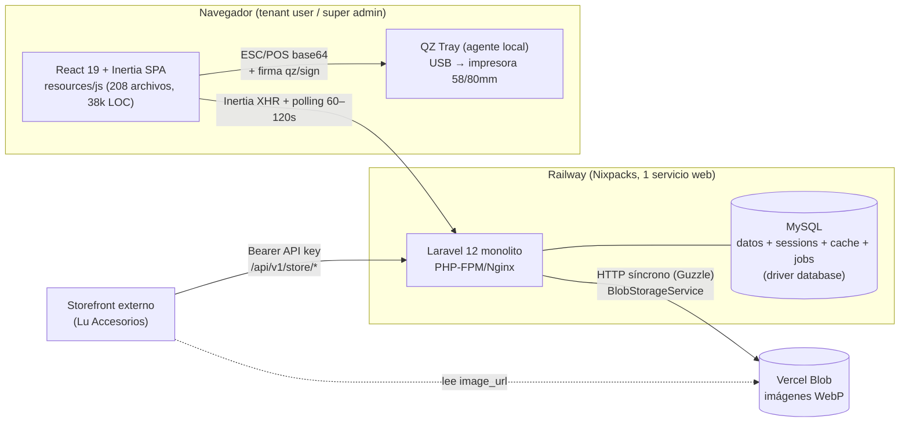
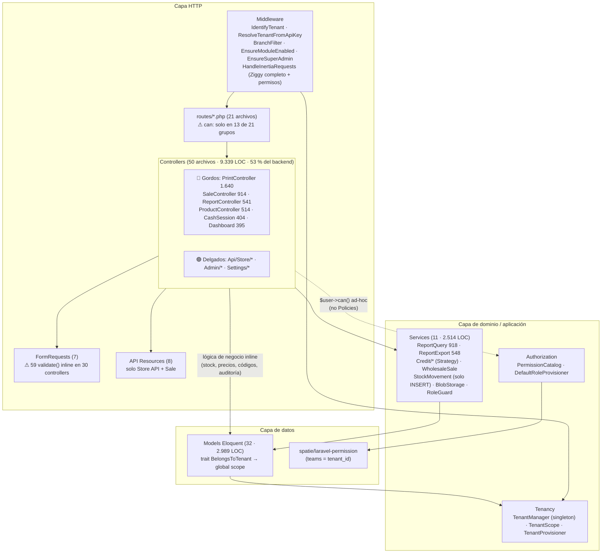
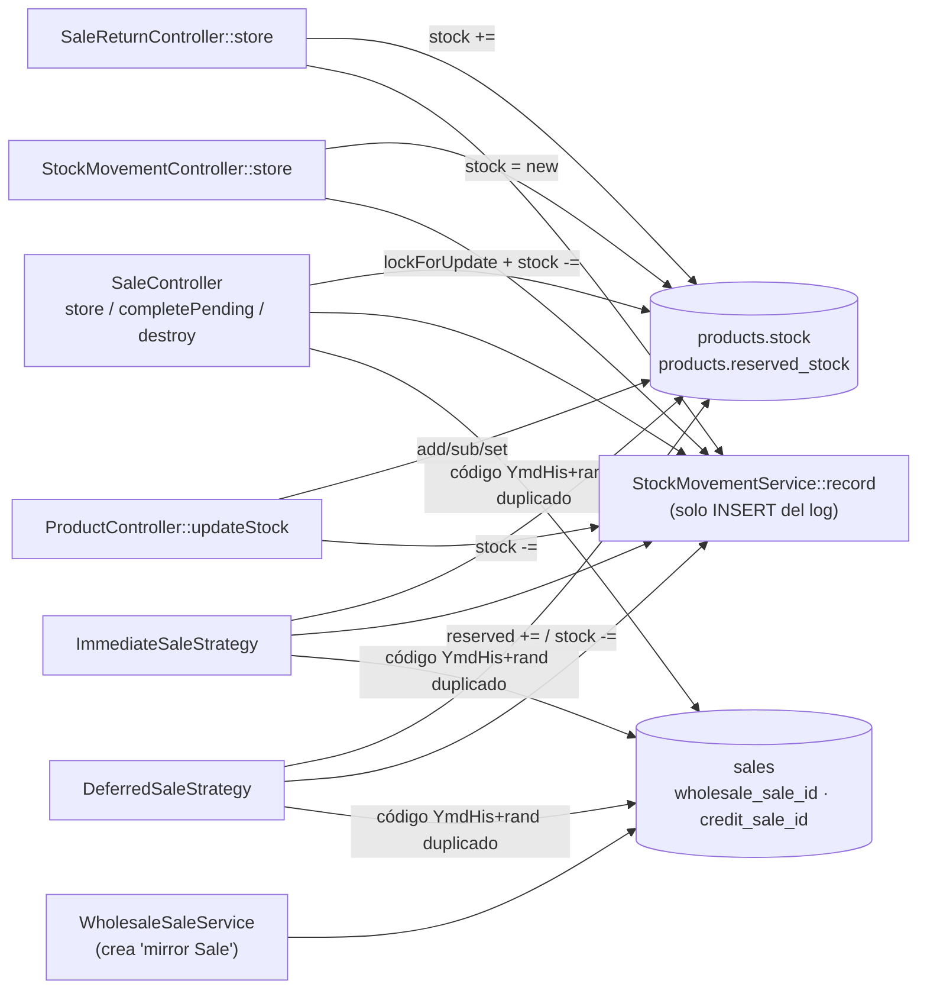

# 04 — Auditoría de Arquitectura (AGENTE ARQUITECTURA)

> Proyecto: **Stokity v2** — POS SaaS multi-tenant
> Stack: Laravel 12.19 · Inertia 2 · React 19.1 · TypeScript 5.9 · Tailwind 4.1 · MySQL · Railway (Nixpacks)
> Fecha: 2026-10-07 · Commit auditado: `4cf28d9` (master)
> Modo: solo lectura. No se modificó código, no se instalaron paquetes y no se tocó producción.
> Herramientas: script propio de complejidad ciclomática sobre `nikic/php-parser` (ya en vendor), detector de duplicación por ventanas de 8 líneas, PHPStan/Larastan (vendor), `composer outdated/audit`, `npm outdated/audit`, `git log` (churn), suite Pest local (SQLite).

---

## Resumen ejecutivo

La aplicación es un **monolito modular por capas (MVC + Service Layer parcial)** sobre Laravel + Inertia. El núcleo de multitenancy (`TenantManager` + `TenantScope` + `BelongsToTenant`) y el RBAC (Spatie teams + `PermissionCatalog`) están bien diseñados y bien documentados. El API pública del storefront (`/api/v1/store/*`) es la parte más limpia del sistema (Resources, middleware dedicado, rate limiter por API key).

Los problemas principales están en el **dominio transaccional (ventas, stock, devoluciones, impresión)**, que vive en controladores gordos:

1. **Autorización inconsistente**: tres estilos conviven (middleware `can:` en rutas, `$user->can()` dentro de métodos, y nada). Las rutas de ventas, POS, devoluciones, clientes, créditos (crear/ver) e impresión **no verifican el permiso en el servidor**. No hay ninguna Policy.
2. **El servidor confía en los precios del cliente**: `price`, `subtotal` y `net` de la venta llegan del navegador. Los permisos `pos.apply_discount` y `pos.sell_variable_price` existen en el catálogo pero **no se aplican en ningún lado**.
3. **Las reglas `exists:` no filtran por tenant** (36 ocurrencias): una venta puede apuntar a un `client_id`, `seller_id` o `branch_id` de otro tenant.
4. **La mutación de stock está duplicada en 8 lugares** con lógica de lock/validación/movimiento copiada a mano. Los tipos de movimiento son *magic strings* que mezclan inglés y español (`'out'` y `'ingreso'`).
5. **El CI nunca corre**: los workflows escuchan `main`/`develop`, pero la rama es `master`.
6. **Dependencias**: 52 avisos de seguridad en Composer (15 paquetes) y 16 en npm (2 críticos, 11 altos).

Deuda técnica estimada: **unos 68 días-persona** (ratio aproximado del 9–11 % sobre el costo de reescritura). Ver la sección [Deuda Técnica](#deuda-técnica).

---

### Diagrama Actual (Mermaid)

#### 1. Vista de contenedores (despliegue)



#### 2. Vista de componentes (capas lógicas reales)



#### 3. Acoplamiento del dominio "Venta" (estado actual)



**Patrón actual**: monolito MVC en capas con *Service Layer* aplicado de forma oportunista. Los módulos nuevos (Créditos, Wholesale, Store API) usan servicios, Strategy y Resources. Los módulos originales (Ventas, Stock, Impresión, Reportes HTTP, Dashboard/Finanzas) siguen con *Transaction Script* dentro del controlador. No hay capa de dominio explícita (Actions/DTOs/Enums/Events), no hay Policies, no hay Jobs y no hay Events/Listeners.

---

### Métricas de Código

#### Tamaño (LOC físicas)

| Capa | Archivos | LOC | % backend |
|---|---:|---:|---:|
| `app/Http/Controllers` | 50 | 9.339 | **53 %** |
| `app/Models` | 32 | 2.989 | 17 % |
| `app/Services` | 11 | 2.514 | 14 % |
| `app/Authorization` | 2 | 631 | 4 % |
| `app/Http/Middleware` | 11 | 565 | 3 % |
| `app/Http/Requests` | 7 | 481 | 3 % |
| `app/Console` | 5 | 418 | 2 % |
| `app/Tenancy` | 3 | 239 | 1 % |
| `app/Http/Resources` | 8 | 232 | 1 % |
| **Total backend `app/`** | **131** | **17.602** | |
| Frontend `resources/js` (ts/tsx) | 208 | 38.263 | — |
| Tests PHP (Pest) | 66 | 8.830 | 475 tests / 1.654 aserciones, **todos en verde** (7,5 s en paralelo) |
| Tests JS (Vitest) | 14 | — | |
| Migraciones | 73 | — | |
| Rutas | 21 archivos | 645 | |

**Ratio test/código backend**: 0,50 (8,8k / 17,6k). Es aceptable, pero está mal distribuido: `PrintController` (1.640 LOC) solo tiene `PrintLabelsTest`.

#### Complejidad ciclomática (backend, 650 métodos analizados)

- CC media: **2,72** (saludable en general)
- Métodos con CC > 10: **22** · con CC > 20: **5** · métodos > 50 LOC: **40**

| # | Método | Archivo:línea | LOC | CC |
|---|---|---|---:|---:|
| 1 | `PrintController::printReceipt` | `app/Http/Controllers/PrintController.php:969` | 148 | **28** |
| 2 | `PrintController::returnReceipt` | `app/Http/Controllers/PrintController.php:309` | 152 | **23** |
| 3 | `SaleController::store` | `app/Http/Controllers/SaleController.php:105` | 150 | **23** |
| 4 | `SaleReturnController::store` | `app/Http/Controllers/SaleReturnController.php:18` | 133 | **22** |
| 5 | `StockMovementController::store` | `app/Http/Controllers/StockMovementController.php:117` | 104 | **22** |
| 6 | `PrintController::cashSessionReport` | `app/Http/Controllers/PrintController.php:149` | 156 | 17 |
| 7 | `ReportExportService::streamGeneralCsv` | `app/Services/ReportExportService.php:120` | 79 | 17 |
| 8 | `SaleController::completePending` | `app/Http/Controllers/SaleController.php:301` | 119 | 14 |
| 9 | `ReportExportService::generatePdfHtml` | `app/Services/ReportExportService.php:46` | 73 | 14 |
| 10 | `ProductController::index` | `app/Http/Controllers/ProductController.php:30` | 68 | 13 |
| 11 | `IdentifyTenant::handle` | `app/Http/Middleware/IdentifyTenant.php:34` | 66 | 12 |
| 12 | `PrintController::creditReceipt` | `app/Http/Controllers/PrintController.php:1421` | 116 | 12 |
| 13 | `FinanceController::summary` | `app/Http/Controllers/FinanceController.php:19` | **163** | 8 |

**Clases "God Object"** (por número de métodos / LOC): `PrintController` (30 métodos, 1.622 LOC de clase), `ReportQueryService` (27 / 905), `ReportController` (20 / 526), `SaleController` (19 / 895), `ReportExportService` (19 / 542).

#### Frontend: componentes más grandes y complejos

| Componente | LOC | `useState` | `useEffect` | Observación |
|---|---:|---:|---:|---|
| `resources/js/pages/pos/index.tsx` | **2.095** | **45** | 11 | God component. Es el archivo con más churn del repo (31 commits en 2026) |
| `pages/sales/create.tsx` | 973 | 8 | 5 | Duplica la lógica de carrito del POS |
| `pages/settings/ticket.tsx` | 809 | 3 | 0 | |
| `pages/finances/index.tsx` | 804 | 10 | 0 | |
| `pages/expenses/index.tsx` | 762 | 12 | 0 | |
| `pages/sales/show.tsx` | 750 | 4 | 0 | |
| `pages/products/edit.tsx` / `create.tsx` | 706 / 636 | 10 / — | 2 | Formularios casi gemelos |
| `pages/admin/tenants/show.tsx` | 704 | 8 | 4 | |
| `pages/reports/*` (6 páginas) | 430–672 c/u | — | — | Estructura repetida |

- Tipado: `strict: true` en `tsconfig.json`; solo **3** usos de `any`. Hay **26** `@ts-ignore`/`eslint-disable`.
- **20 formateadores de moneda locales** (`formatCOP`/`formatCurrency`) a pesar de que existe `resources/js/lib/format.ts:41`. Ejemplos: `pages/pos/index.tsx:84`, `pages/sales/create.tsx:26`, `pages/sales/edit.tsx:52`, `pages/cash-sessions/{show,index,close}.tsx`, `pages/reports/*.tsx`, `components/dashboard/*.tsx`.

#### Duplicación (ventanas de 8 líneas significativas)

| Ámbito | Líneas significativas | Duplicación aprox. | Hotspots |
|---|---:|---:|---|
| Frontend | 24.201 | **~11,3 %** | `reports/sellers-report`, `branches-report`, `returns-report`, `products-report`, `sales-detail`; `users/create` ↔ `users/edit`; `clients/edit`; `finances`/`expenses` |
| Backend | 8.249 | ~2,0 % | `ReportQueryService`, `PrintController`, `SaleController`, `ImmediateSaleStrategy` ↔ `DeferredSaleStrategy`, `RoleRequest` ↔ `TenantRoleRequest` |

#### Calidad estática

- PHPStan nivel 5 (configurado): **0 errores**, pero `ReportController.php` está **excluido** en `phpstan.neon` ("archivo masivo") y hay supresiones globales por ruta para `ReportQueryService`.
- PHPStan nivel 8 (prueba ad-hoc): **940 errores**. Mide lo lejos que está el código de un tipado estricto.
- Enums PHP: **0**. Hay 13 constantes `STATUS_*`/`TYPE_*` y muchos *magic strings* (estados de venta, tipos de movimiento, métodos de pago).

#### Churn (commits 2026 por archivo, con `git log`)

`pos/index.tsx` 31 · `SaleController.php` 25 · `types/index.d.ts` 22 · `app-sidebar.tsx` 20 · `BusinessSetting.php` 19 · `PrintController.php` 18 · `ProductController.php` 18.
**Complejidad alta cruzada con churn alto en `pos/index.tsx`, `SaleController` y `PrintController`**: estos son los tres hotspots donde el refactor tiene mejor ROI.

#### Salud de dependencias

**Composer (directas, desactualizadas)**

| Paquete | Actual | Última | Nota |
|---|---|---|---|
| laravel/framework | 12.19.3 | 13.35.0 | 12.x tiene parches (CRLF en regla `email`, *signed URL path confusion*). Subir primero a la última 12.x |
| inertiajs/inertia-laravel | 2.0.3 | 3.5.1 | Major; requiere migrar también `@inertiajs/react` 2→3 |
| mike42/escpos-php | 4.0 | 5.0 | Major; crítico para impresión, probar con hardware |
| chillerlan/php-qrcode | 5.0.5 | 6.0.1 | Major |
| pestphp/pest | 3.8 | 4.7 | Major (dev) |
| barryvdh/laravel-dompdf | 3.1.1 | 3.1.2 | Arrastra **dompdf con 6 CVE** (lectura de archivos locales vía SVG, DoS) |

`composer audit`: **52 avisos en 15 paquetes**. Los más relevantes: `guzzlehttp/guzzle` (alto: *host-check bypass*; lo usa `BlobStorageService`), `guzzlehttp/psr7` (inyección CRLF), `dompdf/dompdf` (lectura de archivos locales), `laravel/framework` (alto: inyección CRLF en la regla `email`), `league/commonmark` (varios altos de DoS/XSS, transitivo), `symfony/*`.

**npm**: `npm audit --omit=dev` → **16 vulnerabilidades (2 críticas: `shell-quote`, `tar`; 11 altas: `vite ≤6.4.2`, `axios`, `rollup`, `postcss`, `lodash`, `js-cookie ≤3.0.5`, `form-data`, `nanoid`, `picomatch`…)**. Casi todas se corrigen con `npm audit fix` sin cambiar majors.

**Higiene**:
- Existen `package-lock.json` **y** `yarn.lock`. Riesgo de builds no deterministas.
- En `dependencies` hay herramientas de build/dev (`concurrently`, `globals`, `typescript`, `@types/*`, `@vitejs/plugin-react`, `vite`, `laravel-vite-plugin`). No afecta al bundle, pero ensucia la auditoría de producción.
- `lucide-react` 0.475 (la última es 1.52, major) y `date-fns` 3 (la última es 4): no son urgentes.
- `composer.json` sigue llamándose `laravel/react-starter-kit`. Restos del starter: la frase de `Inspiring` compartida en cada request (`HandleInertiaRequests.php:46`) y el comando `inspire` en `routes/console.php`.
- Uso de dependencias: todas las directas se usan (headlessui 3 archivos, react-date-range 1, js-cookie 1, react-qr-code 4). No se detectaron dependencias muertas significativas.

---

### Deuda Técnica

Formato de cada hallazgo: **Estado actual · Problema · Impacto · Recomendación · Esfuerzo · Prioridad**.

#### DT-01 — Autorización descentralizada, sin Policies y con huecos en el servidor
- **Estado actual**: hay tres estilos mezclados. (a) `can:` en grupos de rutas (`routes/branches.php:7`, `routes/reports.php:8`, `routes/wholesale.php:8-22`…). (b) `$user->can()`/`abort_if` dentro de métodos (112 llamadas). (c) Nada. `app/Policies/` no existe.
- **Problema**: estas rutas **no verifican el permiso del catálogo en el backend**:
  - `routes/sales.php:9-30`: `pos.index`, `sales.index`, `sales.store`, `sales.complete`, `sales.pending.*` y `sales.returns.store`. Los permisos `pos.access`, `sales.view`, `sales.create`, `sales.manage_pending` y `sales.refund` solo se consultan en `resources/js/components/app-sidebar.tsx:84,97`.
  - `routes/clients.php:6-8`: `Route::resource` sin `can:`. `ClientController` solo verifica `clients.wholesale.manage` (`:89`).
  - `routes/credits.php:7-16`: `credits.view`/`credits.create` no se verifican; solo `update`/`cancel` (`CreditSaleController.php:219,292`).
  - `routes/printing.php:12-19`: la generación de recibos solo comprueba la sucursal.
  - `routes/cash-sessions.php`: abrir caja (`store`) no exige permiso.
- **Impacto**: un rol personalizado sin `sales.create` (o sin `pos.access`) puede vender igual con un POST directo. El RBAC granular, la funcionalidad estrella del producto, queda en "solo UI" para el módulo más crítico.
- **Recomendación**: crear Policies (`SalePolicy`, `ClientPolicy`, `CreditSalePolicy`, `CashSessionPolicy`, `ProductPolicy`) que encapsulen **permiso + alcance de sucursal** (la comprobación `isRestrictedToOwnBranch() && branch_id !==` está copiada 72 veces en 21 archivos). Registrarlas y usar `->can('create', Sale::class)` en las rutas o `Gate::authorize()` en los controladores. Añadir un test arquitectónico (Pest `arch()` o un test de rutas) que falle si una ruta autenticada no tiene middleware `can:` ni una llamada a `authorize`.
- **Esfuerzo**: 4 días (~600 LOC nuevas en Policies + ~250 LOC eliminadas de controladores + tests).
- **Prioridad**: **Crítica** (relacionado con el informe de Seguridad).

#### DT-02 — El servidor confía en precios, subtotales y neto enviados por el cliente
- **Estado actual**: `SaleController::store` valida `products.*.price`, `products.*.subtotal` y `net` como `numeric|min:0` (`SaleController.php:132-136`) y los persiste tal cual (`:199-205`). Solo el impuesto y el descuento se recalculan, y lo hacen **sobre el `net` enviado** (`:151-152`). `validateStockAndTax` (`:870+`) hace `Product::find()` por ítem (N+1) y calcula el impuesto sobre el `subtotal` del cliente. `pos.apply_discount` y `pos.sell_variable_price` solo aparecen en `DefaultRoleProvisioner.php:233` y nunca se evalúan.
- **Problema**: la regla de negocio de precio no vive en el dominio. Un usuario con acceso al POS puede registrar una venta a precio arbitrario o aplicar descuentos sin permiso.
- **Impacto**: integridad financiera (caja, utilidad, COGS, reportes) y fraude interno. Además el cálculo está duplicado en el frontend (`pos/index.tsx`, `sales/create.tsx`) y en tres flujos del backend (`store`, `completePending`, estrategias de crédito).
- **Recomendación**: crear `App\Domain\Sales\SalePricingService` (o la Action `PriceCart`) que reciba `[product_id, quantity, price_override?]`, cargue los productos en **una** consulta y calcule subtotal, impuesto, descuento y total. Si `price_override` difiere del `sale_price`, exigir `pos.sell_variable_price`. Si hay descuento, exigir `pos.apply_discount`. El frontend pasa a enviar solo cantidades y overrides, y muestra el resultado (o hace una vista previa vía endpoint).
- **Esfuerzo**: 4–5 días (~350 LOC de servicio + ~200 LOC eliminadas en controladores/estrategias + tests de precio).
- **Prioridad**: **Crítica**.

#### DT-03 — Reglas `exists:` sin alcance de tenant (integridad referencial entre tenants)
- **Estado actual**: 36 reglas `exists:tabla,id` en 13 archivos (`SaleController` 9, `ExpenseController` 7, `ExpenseTemplateController` 3, `CreditSaleController` 3…). Solo 3 usan `Rule::exists()->where(tenant_id)` (`UserController.php:80,175`).
- **Problema**: la regla `exists` consulta la base de datos sin el global scope. `SaleController::store` acepta un `client_id`, `seller_id` o `branch_id` de **otro tenant**, y `Sale::create` lo guarda con el `tenant_id` del usuario actual.
- **Impacto**: filas con referencias cruzadas entre tenants, posibles fugas en vistas que hacen `->load('client')` y corrupción de reportes.
- **Recomendación**: crear `App\Rules\TenantExists` (o un helper `Rule::tenantExists('clients')`) que añada `where tenant_id = TenantManager::id()`, y reemplazar las 36 ocurrencias. Un test arquitectónico con grep debe prohibir `'exists:'` crudo en `app/`.
- **Esfuerzo**: 1 día (~40 LOC de regla + ~36 líneas cambiadas + 5 tests).
- **Prioridad**: **Alta**.

#### DT-04 — Mutación de inventario duplicada en 8 lugares
- **Estado actual**: `StockMovementService` (`app/Services/StockMovementService.php:13-42`) solo **inserta el log**. Cada llamador hace a mano el `lockForUpdate`, la comprobación de stock, `stock ±=` y `save`:
  `SaleController.php:209-232` (store), `:385-405` (completePending), `:835-852` (destroy), `SaleReturnController.php:105-125`, `StockMovementController.php:155-215`, `ProductController.php:390-438`, `ImmediateSaleStrategy.php:90-105`, `DeferredSaleStrategy.php:30-40, 90-100`.
- **Problema**: hay invariantes de dominio dispersos (no permitir stock negativo, ignorar servicios, respetar `reserved_stock`). Los tipos de movimiento son *magic strings* inconsistentes: `'out'` (inglés) frente a `'ingreso'` (español). La migración `2026_03_23_000001_unify_stock_movement_type_ingreso.php` muestra que ya hubo un incidente de renombrado.
- **Impacto**: cualquier cambio de regla (por ejemplo, stock por sucursal o lotes) exige tocar 8 sitios; alto riesgo de regresión.
- **Recomendación**: convertir el servicio en `InventoryService` con `decrease(Product|int, qty, MovementContext)`, `increase(...)`, `adjust(...)`, `reserve(...)` y `release(...)`, cada uno con el lock, la validación y el log dentro. Crear `enum StockMovementType: string { case In = 'ingreso'; case Out = 'out'; case Adjustment...; }` con cast en `StockMovement`.
- **Esfuerzo**: 3 días (~250 LOC nuevas, ~300 LOC eliminadas, cambios en 8 llamadores).
- **Prioridad**: **Alta**.

#### DT-05 — `PrintController` es un God Object (1.640 LOC, 30 métodos, CC hasta 28)
- **Estado actual**: un solo controlador mezcla endpoints HTTP, firma QZ, plantillas de recibo (venta, devolución, crédito, abono, cierre de caja, etiquetas), rasterización de logo/QR/código de barras con GD, descarga de imágenes remotas a archivos temporales (`downloadToTempFile`, `:1310`) y formateo.
- **Problema**: viola SRP, es imposible de testear por partes (solo existe `tests/Feature/Printing/PrintLabelsTest.php`) y concentra el bug abierto de corte superior. Tiene 18 commits en 2026.
- **Impacto**: cada ajuste de impresora arriesga romper todos los tickets. No hay red de seguridad.
- **Recomendación**: dividirlo en `Printing/EscPos/ReceiptRenderer` (interfaz) con implementaciones `SaleReceipt`, `ReturnReceipt`, `CreditReceipt`, `CreditPaymentReceipt`, `CashSessionReport` y `ProductLabel`, más `Printing/EscPos/BitmapPrinter` (logo/QR/barcode), `Printing/EscPos/PrinterFactory` (`createPrinter`, reset, feeds), `Printing/LogoCache` (descarga, redimensión y **caché** del logo procesado por tenant, en lugar de bajarlo de Vercel Blob en cada ticket) y `QzSigningController`. El controlador queda en unas 150 LOC. Añadir tests *golden-file* de bytes ESC/POS por plantilla.
- **Esfuerzo**: 5 días (~1.400 LOC movidas, ~250 LOC de tests).
- **Prioridad**: **Alta**.

#### DT-06 — Controladores gordos con Transaction Script y validación inline
- **Estado actual**: 59 `->validate()` inline en 30 controladores frente a solo 7 FormRequests. `SaleController::store` (150 LOC, CC 23), `SaleReturnController::store` (133, CC 22), `StockMovementController::store` (104, CC 22), `FinanceController::summary` (163 LOC), `DashboardController::index` (93 LOC de consultas).
- **Problema**: la lógica de negocio (código de venta, snapshot de costo, caja, auditoría) no se puede reutilizar desde la API del storefront, desde comandos ni desde Jobs. La API pública ya necesitará "crear pedido" en la fase 2.
- **Impacto**: duplicación (la generación del código `YmdHis+rand` está en `SaleController.php:157`, `ImmediateSaleStrategy.php:46` y `DeferredSaleStrategy.php:48`) y tests de alto nivel lentos.
- **Recomendación**: extraer las Actions `CreateSale`, `CompletePendingSale`, `CancelSale` y `RegisterSaleReturn` (en `app/Actions/Sales`), que reciban DTOs (`SaleData`) construidos desde FormRequests (`StoreSaleRequest`, `CompletePendingSaleRequest`, `StoreSaleReturnRequest`, `StoreStockMovementRequest`). Crear `SaleCodeGenerator` (con una secuencia por tenant, como ya hace `StorefrontOrderCounter`, en lugar del bucle `do…while exists`). Mover `FinanceController::summary` y `DashboardController::index` a `FinanceQueryService`/`DashboardQueryService` con caché por tenant.
- **Esfuerzo**: 6 días (~900 LOC movidas o nuevas, ~600 LOC eliminadas).
- **Prioridad**: **Alta**.

#### DT-07 — CI no se ejecuta nunca
- **Estado actual**: `.github/workflows/tests.yml` y `lint.yml` se disparan en `push`/`pull_request` a `develop` y `main`. La rama de trabajo y despliegue es **`master`**, y el push a `master` es un deploy en Railway.
- **Problema**: los 475 tests, Pint, ESLint y PHPStan **no protegen** ningún deploy. Además `lint.yml` *reescribe* el código (`pint`, `npm run format`) en lugar de verificarlo (`--test`/`format:check`).
- **Impacto**: alto riesgo de regresiones en producción.
- **Recomendación**: cambiar `branches: [master]`, añadir un job `phpstan` y `npm run types`, usar `pint --test` y `format:check`, y añadir un servicio MySQL 8 en el job de tests (hoy usan SQLite `:memory:`, `phpunit.xml`, y no ejercitan `lockForUpdate` ni los `ALTER … ENUM` crudos de las migraciones). Configurar *branch protection* y un check obligatorio antes del deploy de Railway.
- **Esfuerzo**: 0,5 día (~40 LOC de YAML).
- **Prioridad**: **Crítica** (esfuerzo mínimo, impacto máximo).

#### DT-08 — Componente POS monolítico (2.095 LOC, 45 `useState`)
- **Estado actual**: `resources/js/pages/pos/index.tsx` concentra carrito, búsqueda, clientes, caja (abrir, cerrar, movimientos), cotizaciones, atajos de teclado, impresión, sonido y modales.
- **Problema**: estado disperso en 45 `useState` con 11 `useEffect` interdependientes. Es el archivo con más churn del repositorio y la lógica de carrito está duplicada en `sales/create.tsx` (973 LOC) y `credits/create.tsx` (640).
- **Impacto**: re-renders del componente completo en cada tecla, bugs de sincronización y onboarding difícil.
- **Recomendación**: extraer `useCart()` (con `useReducer`: add/remove/qty/discount/totals; compartido con `sales/create` y `credits/create`), `useCashSession()`, `usePendingSales()`, `usePosShortcuts()` y los componentes `PosProductSearch`, `PosCartPanel`, `PosPaymentDialog`, `PosSessionBar` y `PendingSalesDrawer`. Objetivo: `index.tsx` por debajo de 300 LOC.
- **Esfuerzo**: 6 días (~2.000 LOC reorganizadas, ~400 LOC netas eliminadas por compartir el carrito).
- **Prioridad**: **Alta**.

#### DT-09 — Escalabilidad: todo el estado de infraestructura vive en MySQL y el trabajo pesado es síncrono
- **Estado actual**: `SESSION_DRIVER`, `CACHE_STORE` y `QUEUE_CONNECTION` usan `database` (`.env.example`, `config/cache.php:18`, `config/queue.php:16`). No hay Jobs, Events ni scheduler (`routes/console.php` solo tiene `inspire`). Los PDF con DomPDF se generan en el request (`ReportController.php:342-488`). La subida a Vercel Blob con conversión GD es síncrona (`BlobStorageService.php:34-116`). El healthcheck de Railway apunta a `/` (`railway.toml`) en lugar de `/up`. El polling cada 60–120 s se usa en 10 páginas (`hooks/use-polling.ts`), y en el dashboard recarga 7 props pesadas.
- **Problema**: cada request escribe la sesión en MySQL. La caché de reportes (`ReportQueryService`, TTL 900 s) no puede invalidarse por tags con el driver `database`, así que los reportes quedan desactualizados hasta 15 min tras una venta. Una exportación grande bloquea un worker PHP-FPM. Con N usuarios con el POS abierto, el polling genera `N × 3` consultas por minuto solo por el POS.
- **Impacto**: el escalado vertical es la única palanca. El escalado horizontal funciona en teoría (no hay estado local, las imágenes están en Blob) pero desplaza toda la contención a MySQL.
- **Recomendación**:
  1. Añadir Redis en Railway: `CACHE_STORE=redis`, `SESSION_DRIVER=redis`, `QUEUE_CONNECTION=redis`. Invalidar la caché de reportes con tags `tenant:{id}:reports` desde un listener `SaleRecorded`.
  2. Crear un servicio worker en Railway (`php artisan queue:work`) y mover a Jobs: exportaciones PDF/CSV con notificación o descarga diferida, conversión y subida de imágenes, y marcado de créditos vencidos (scheduler).
  3. Cambiar `healthcheckPath = "/up"`.
  4. Evaluar Laravel Reverb (ya documentado en `docs/REVERB.md`) para sustituir el polling del POS y del dashboard.
  5. Si se adopta Octane: `TenantManager` es un singleton con estado (`app/Tenancy/TenantManager.php`, `TenancyServiceProvider.php:17`) y habría que resetearlo por request.
- **Esfuerzo**: 4 días (infra ~1 d, Jobs/listeners ~3 d; ~400 LOC).
- **Prioridad**: **Media** (Alta cuando haya más de 20 tenants activos o más de 50 usuarios POS concurrentes).

#### DT-10 — `TenantScope` es *fail-open*
- **Estado actual**: `app/Tenancy/TenantScope.php` solo filtra `if ($manager->check())`. Sin tenant en contexto, las consultas devuelven **todos** los tenants.
- **Problema**: la seguridad depende de que el middleware `IdentifyTenant`/`ResolveTenantFromApiKey` se haya ejecutado. Una ruta nueva fuera del grupo `web`, un comando Artisan o un Job futuro leerá datos globales sin avisar.
- **Impacto**: riesgo latente de fuga entre tenants al crecer (Jobs, scheduler, nuevas APIs).
- **Recomendación**: hacerlo *fail-closed*. Si no hay tenant y el contexto no está marcado explícitamente como `TenantManager::runAsPlatform()` (superadmin/console), aplicar `whereRaw('1=0')` o lanzar `MissingTenantContext` en entornos que no sean producción. Mantener `scopeAllTenants()` como escape explícito.
- **Esfuerzo**: 1,5 días (~60 LOC + revisión de los usos del panel admin y comandos + tests).
- **Prioridad**: **Media-Alta**.

#### DT-11 — Doble sistema de roles (columna legacy `users.role` + Spatie)
- **Estado actual**: `User::hasPermissionTo` (`app/Models/User.php:141-169`) recurre a `DefaultRoleProvisioner::defaultPermissionsForLegacyRole($this->role)` cuando el usuario no tiene rol Spatie. `isAdmin()/isEncargado()/isVendedor()` siguen leyendo la columna (`User.php:98-114`). `SaleController::create` lista vendedores con `User::whereIn('role', ['administrador','encargado','vendedor'])` (`SaleController.php:92`).
- **Problema**: los usuarios con roles personalizados **no aparecen como vendedores** en `sales/create`. Hay dos fuentes de verdad y la lógica de permisos tiene dos ramas.
- **Impacto**: bugs funcionales sutiles y complejidad accidental en la ruta más caliente (cada `can()`).
- **Recomendación**: verificar en producción que todos los usuarios tienen rol Spatie (comando `roles:assign-legacy` ya existente). Después eliminar el *fallback*, reemplazar `isAdmin()` y similares por permisos o `dataScope`, y dejar `role` solo para `super_admin` (o moverlo a `is_super_admin` booleano).
- **Esfuerzo**: 2 días (~150 LOC eliminadas + migración de datos + tests).
- **Prioridad**: **Media**.

#### DT-12 — Acoplamiento Venta ↔ Mayorista ↔ Crédito por "mirror sale" y FKs anulables
- **Estado actual**: `WholesaleSaleService::createMirrorSale` inserta un `Sale` espejo. La tabla `sales` tiene `wholesale_sale_id` y `credit_sale_id`, y 11 consultas deben excluir `whereNull('wholesale_sale_id')` (por ejemplo `SaleController.php:29`, `DashboardController`). `SaleController` bloquea ediciones según `credit_sale_id` (`:708,737,830`).
- **Problema**: `sales` funciona como libro mayor genérico y además como entidad POS. Cada nuevo canal (storefront, fase 2) añadiría otra FK anulable y otro filtro.
- **Impacto**: reportes que olvidan el filtro cuentan doble, y el acoplamiento bidireccional entre módulos crece.
- **Recomendación**: formalizar `sales.channel` (`enum SaleChannel { Pos, Wholesale, Credit, Storefront }`) más `source_type/source_id` polimórfico, y crear scopes `Sale::pos()` y `Sale::forReporting()`. Publicar el evento de dominio `SaleRecorded` para que reportes, caja y caché reaccionen sin acoplarse.
- **Esfuerzo**: 3 días (~200 LOC + migración + ajuste de 11 consultas).
- **Prioridad**: **Media**.

#### DT-13 — Inventario por fila de producto y sucursal (modelo de dominio)
- **Estado actual**: `products.branch_id` es NOT NULL (`create_products_table` línea 29) y `stock` es una sola columna por producto. Un mismo SKU en dos sucursales son dos productos.
- **Problema**: no hay transferencias entre sucursales, el catálogo está duplicado por sucursal y la API del storefront tiene que elegir una fila.
- **Impacto**: limita la escala funcional (cadenas con muchas sucursales) y complica los reportes por producto.
- **Recomendación** (estratégica): crear una tabla `branch_product_stock(product_id, branch_id, stock, reserved_stock, min_stock)` con un catálogo de producto único por tenant. Se apoya en DT-04: con `InventoryService` como único punto de mutación, la migración se vuelve tratable.
- **Esfuerzo**: 12–15 días.
- **Prioridad**: **Baja** a corto plazo; decisión de roadmap.

#### DT-14 — Duplicación en el frontend y utilidades no reutilizadas
- **Estado actual**: alrededor de 11 % de bloques duplicados. Hay 20 formateadores de moneda locales, 6 páginas de reportes con el mismo esqueleto (filtros, tabla, exportar) y los pares `users/create`↔`edit`, `products/create`↔`edit` y `branches/create`↔`edit`.
- **Problema/Impacto**: inconsistencias de formato COP y costo de mantenimiento multiplicado.
- **Recomendación**: unificar en `lib/format.ts` (`formatCOP`) y crear la regla ESLint `no-restricted-syntax` contra `Intl.NumberFormat` fuera de `lib/`. Crear `components/reports/ReportLayout` + `useReportFilters()` + `ReportTable`. Hacer `ProductForm`, `UserForm` y `BranchForm` compartidos entre create y edit.
- **Esfuerzo**: 4 días (~1.500 LOC eliminadas netas).
- **Prioridad**: **Media**.

#### DT-15 — Contratos de datos Inertia sin Resources y payload global pesado
- **Estado actual**: solo `SaleResource` y los Resources de Store usan esta capa. Los controladores pasan modelos Eloquent completos a Inertia (`'clients' => Client::orderBy('name')->get()`, `SaleController.php:91`). `HandleInertiaRequests` comparte **el mapa completo de Ziggy** (todas las rutas, incluidas `/admin/*`) y una cita `Inspiring` en cada request (`HandleInertiaRequests.php:46-63`). `types/index.d.ts` (458 LOC, 22 commits) se mantiene a mano.
- **Problema**: hay sobreexposición de columnas al navegador, divulgación del mapa de rutas del panel superadmin a cualquier usuario y deriva entre los tipos TS y el backend.
- **Impacto**: peso de cada respuesta, superficie de información y bugs de tipos.
- **Recomendación**: usar Resources o `->only()`/`select()` explícitos por página. Filtrar Ziggy con grupos (`config/ziggy.php` con `groups: tenant, admin`) según el rol. Eliminar la cita. Valorar `spatie/laravel-typescript-transformer` o `laravel-data` para generar los tipos TS desde DTOs.
- **Esfuerzo**: 3 días.
- **Prioridad**: **Media**.

#### DT-16 — Límites funcionales ocultos
- **Estado actual**: el POS carga como máximo 500 clientes (`PosController.php:24`) y los recarga cada 60 s por polling (`pos/index.tsx:315`). `validateStockAndTax` hace N+1 (`Product::find` por ítem) y luego vuelve a leer con lock.
- **Problema/Impacto**: un tenant con más de 500 clientes no puede seleccionar al cliente 501 en el POS, y hay consultas redundantes en la ruta más caliente.
- **Recomendación**: cambiar a búsqueda asíncrona de clientes (`/clients/search?q=`, *debounce*, límite 20), quitar `clients` del polling y precargar los productos con `whereIn` dentro del pricing (DT-02).
- **Esfuerzo**: 1 día.
- **Prioridad**: **Media**.

#### DT-17 — Tipado PHP y análisis estático
- **Estado actual**: PHPStan nivel 5 con `ReportController` excluido y supresiones por archivo. Nivel 8 da 940 errores. No hay enums nativos (estados de venta `'completed'|'pending'|'cancelled'|'credit_pending'`, tipos de movimiento, métodos de pago como strings).
- **Recomendación**: quitar la exclusión de `ReportController` y generar un **baseline**. Subir un nivel por sprint (6 → 7 → 8) bloqueando errores nuevos en CI. Introducir `SaleStatus`, `StockMovementType`, `CashMovementType` y `CreditStatus` como `enum` con casts.
- **Esfuerzo**: 6 días repartidos (2 d enums ~300 LOC, 4 d de tipado incremental).
- **Prioridad**: **Media**.

#### DT-18 — Dependencias vulnerables y desactualizadas
- **Estado actual**: ver la tabla de salud de dependencias (52 avisos en Composer, 16 en npm con 2 críticos). Laravel 12.19 y Vite 6.3.5.
- **Recomendación**:
  - **Inmediato**: `composer update laravel/framework guzzlehttp/* dompdf/dompdf barryvdh/laravel-dompdf league/commonmark symfony/*` (dentro de los majors actuales) y `npm audit fix`. Eliminar `yarn.lock`. Mover las herramientas de build a `devDependencies`.
  - **Trimestre**: Laravel 13 + Inertia 3 (servidor y cliente), Pest 4, escpos-php 5 (con prueba física).
  - Añadir Dependabot o Renovate y `composer audit`/`npm audit --audit-level=high` en CI.
- **Esfuerzo**: 1 día (parches) + 5 días (majors).
- **Prioridad**: **Alta** (parches) / **Media** (majors).

#### DT-19 — Código muerto y restos
- `routes/web.php:26-28`: la ruta `report-sales` renderiza `pages/report-sales/index.tsx`, que parece un remanente de reportes. Verificar y eliminar.
- Comentarios-placeholder en `routes/web.php:20-24`.
- `routes/console.php` (`inspire`), la cita `Inspiring` y el nombre del paquete en `composer.json`.
- El directorio vacío `stokity_v2/` en la raíz.
- Documentación desactualizada: `PLAN.md` dice "Última actualización 2026-09-03" y "Créditos 🔲 Pendiente", aunque los créditos están implementados. Hay 8 documentos de plan en la raíz (`*_PLAN.md`, `ROLES-AUDIT.md`…).
- `BranchFilterMiddleware` llama a `view()->share()` (Blade, sin efecto en Inertia) y a `$request->merge(['user_branch_id'])`. Verificar si algún controlador lo lee.
- **Esfuerzo**: 0,5 día. **Prioridad**: **Baja**.

#### Lo que está bien (conservar)
- Núcleo de tenancy limpio y testeado: `TenantManager::runAs` con `finally`, prioridad de middleware antes de `SubstituteBindings` (`bootstrap/app.php:27-30`), claves de caché por tenant (`ReportQueryService.php:31`, `BusinessSetting::cacheKey`).
- `PermissionCatalog` como fuente única con dependencias `requires`, y tests de RBAC/BranchIsolation/Tenancy.
- Store API: Resources dedicados, middleware por capacidad de la API key y rate limiter por hash del token, con la justificación documentada (`AppServiceProvider.php:44-66`).
- Patrón Strategy en créditos (`Services/Credit/Strategies`).
- Locks pesimistas en las rutas de stock (21 `lockForUpdate`).
- Suite Pest de 475 tests en verde, en 7,5 s.

---

### Refactorings Necesarios

Ordenados por ROI (impacto / esfuerzo). LOC = líneas estimadas a tocar (añadidas + eliminadas).

| # | Refactoring | Archivos clave | LOC est. | Días | Prioridad |
|---|---|---|---:|---:|---|
| R1 | Arreglar triggers de CI (`master`), añadir PHPStan/tsc, MySQL de servicio y modo `--test` | `.github/workflows/*.yml` | 40 | 0,5 | Crítica |
| R2 | Parches de seguridad de dependencias + quitar `yarn.lock` | `composer.lock`, `package-lock.json` | — | 1 | Alta |
| R3 | `TenantExists` rule y sustituir 36 `exists:` | `app/Rules/TenantExists.php` + 13 archivos | 80 | 1 | Alta |
| R4 | Policies + `can:` en rutas de sales/pos/clients/credits/cash/print + test arquitectónico de rutas | `app/Policies/*`, `routes/{sales,clients,credits,cash-sessions,printing}.php`, controllers | 850 | 4 | Crítica |
| R5 | `SalePricingService` server-side + aplicar `pos.apply_discount`/`pos.sell_variable_price` | `SaleController.php:105-254,301-420,870+`, estrategias de crédito, `pos/index.tsx`, `sales/create.tsx` | 550 | 4,5 | Crítica |
| R6 | `InventoryService` + `enum StockMovementType` | `StockMovementService.php` → `InventoryService.php`, 8 llamadores | 550 | 3 | Alta |
| R7 | Actions + FormRequests para Ventas/Devoluciones/Stock + `SaleCodeGenerator` | `app/Actions/Sales/*`, `app/Http/Requests/*`, `SaleController`, `SaleReturnController`, `StockMovementController` | 1.500 | 6 | Alta |
| R8 | Dividir `PrintController` en renderers + `LogoCache` + tests golden | `app/Printing/**`, `PrintController.php` | 1.650 | 5 | Alta |
| R9 | Descomponer `pos/index.tsx` + `useCart` compartido | `pages/pos/*`, `hooks/use-cart.ts`, `sales/create.tsx`, `credits/create.tsx` | 2.400 | 6 | Alta |
| R10 | Redis (cache/session/queue) + worker + Jobs para export/imagenes + `/up` + invalidación de caché por evento | `config`, `railway.toml`, `app/Jobs/*`, `app/Events/SaleRecorded.php` | 400 | 4 | Media |
| R11 | `TenantScope` fail-closed + `runAsPlatform()` | `app/Tenancy/*`, Admin controllers, comandos | 120 | 1,5 | Media-Alta |
| R12 | Eliminar el rol legacy | `User.php`, `DefaultRoleProvisioner.php`, `SaleController.php:92`, migración | 250 | 2 | Media |
| R13 | `sales.channel` + scopes + evento de dominio | `Sale.php`, `WholesaleSaleService.php`, 11 consultas | 250 | 3 | Media |
| R14 | Unificar formateadores + `ReportLayout` + formularios compartidos | `lib/format.ts`, `pages/reports/*`, `pages/{users,products,branches}/*` | 2.000 (−1.500 netas) | 4 | Media |
| R15 | Resources/`select` en props Inertia, Ziggy filtrado, tipos TS generados | `HandleInertiaRequests.php`, controllers, `types/index.d.ts` | 600 | 3 | Media |
| R16 | Búsqueda asíncrona de clientes en el POS + eliminar el N+1 | `PosController.php:24`, `pos/index.tsx:315`, `ClientController` | 150 | 1 | Media |
| R17 | Enums de dominio + baseline PHPStan y subida de nivel | `app/Enums/*`, `phpstan.neon` | 400+ | 6 | Media |
| R18 | Limpieza de restos y documentación (`PLAN.md` al día) | varios | 100 | 0,5 | Baja |
| R19 | Stock por sucursal (`branch_product_stock`) | Product, InventoryService, Store API, reportes | 2.500 | 13 | Baja (estratégico) |

#### Bocetos de implementación (los de más impacto)

**R4 — Policy con alcance de sucursal (sustituye ~72 `abort_if` copiados)**
```php
// app/Policies/SalePolicy.php
final class SalePolicy
{
    public function viewAny(User $u): bool { return $u->can('sales.view'); }
    public function create(User $u): bool  { return $u->can('sales.create'); }
    public function view(User $u, Sale $s): bool   { return $u->can('sales.view')   && $this->inScope($u, $s); }
    public function update(User $u, Sale $s): bool { return $u->can('sales.update') && $this->inScope($u, $s) && ! $s->credit_sale_id; }
    public function refund(User $u, Sale $s): bool { return $u->can('sales.refund') && $this->inScope($u, $s); }
    private function inScope(User $u, Sale $s): bool
    { return ! $u->isRestrictedToOwnBranch() || $s->branch_id === $u->branch_id; }
}
// routes/sales.php
Route::post('sales', [SaleController::class, 'store'])->can('create', Sale::class);
Route::get('pos', [PosController::class, 'index'])->middleware('can:pos.access');
```

**R5/R7 — Venta como Action con precios del servidor**
```php
final class CreateSale
{
    public function __construct(private SalePricingService $pricing, private InventoryService $inventory,
                                private SaleCodeGenerator $codes) {}

    public function handle(SaleData $data, User $actor): Sale
    {
        $priced = $this->pricing->price($data->items, $data->discount, $actor); // valida overrides/permisos
        return DB::transaction(function () use ($data, $priced, $actor) {
            $sale = Sale::create([...$data->header(), ...$priced->totals(), 'code' => $this->codes->next()]);
            foreach ($priced->lines as $line) {
                $sale->saleProducts()->create($line->toArray());
                if ($data->isCompleted()) $this->inventory->decrease($line->productId, $line->qty, MovementContext::sale($sale, $actor));
            }
            SaleRecorded::dispatch($sale);
            return $sale;
        });
    }
}
```
`SaleController::store` queda en unas 20 líneas: `StoreSaleRequest` → `SaleData::fromRequest()` → `CreateSale::handle()` → redirect.

**R6 — Un solo punto de mutación de stock**
```php
public function decrease(int $productId, int $qty, MovementContext $ctx): Product
{
    $p = Product::lockForUpdate()->findOrFail($productId);
    if ($p->isService()) return $p;
    if ($p->availableStock() < $qty) throw InsufficientStock::for($p, $qty);
    $prev = $p->stock; $p->decrement('stock', $qty);
    $this->log($p, StockMovementType::Out, $qty, $prev, $ctx);
    return $p;
}
```

---

### Roadmap Técnico

```mermaid
gantt
    title Roadmap técnico Stokity v2 (días hábiles, 1 dev)
    dateFormat  YYYY-MM-DD
    axisFormat  %d/%m
    section Fase 0 · Contención (semana 1)
    R1 CI en master + gates               :crit, f0a, 2026-10-08, 1d
    R2 Parches seguridad deps             :crit, f0b, after f0a, 1d
    R3 TenantExists (36 reglas)           :crit, f0c, after f0b, 1d
    section Fase 1 · Integridad del dominio (semanas 2-4)
    R4 Policies + can: en rutas           :crit, f1a, after f0c, 4d
    R6 InventoryService + enum            :f1b, after f1a, 3d
    R5 SalePricingService + permisos POS  :crit, f1c, after f1b, 5d
    R7 Actions/FormRequests Ventas        :f1d, after f1c, 6d
    section Fase 2 · Hotspots (semanas 5-7)
    R8 Split PrintController + tests      :f2a, after f1d, 5d
    R9 Descomponer POS + useCart          :f2b, after f2a, 6d
    R16 Clientes async en POS             :f2c, after f2b, 1d
    section Fase 3 · Escala y plataforma (semanas 8-10)
    R10 Redis + worker + Jobs + /up       :f3a, after f2c, 4d
    R11 TenantScope fail-closed           :f3b, after f3a, 2d
    R12 Eliminar rol legacy               :f3c, after f3b, 2d
    R13 sales.channel + eventos           :f3d, after f3c, 3d
    section Fase 4 · Mantenibilidad continua
    R14 Dedupe frontend                   :f4a, after f3d, 4d
    R15 Contratos Inertia/Ziggy/tipos     :f4b, after f4a, 3d
    R17 Enums + PHPStan nivel 8           :f4c, after f4b, 6d
    R18 Limpieza + docs                   :f4d, after f4c, 1d
```

| Fase | Objetivo medible | Criterio de salida |
|---|---|---|
| **0. Contención** (1 semana) | Ningún deploy sin tests; 0 vulnerabilidades críticas o altas en runtime | CI verde obligatorio en `master`; `composer audit` y `npm audit --omit=dev --audit-level=high` limpios |
| **1. Integridad del dominio** (3 semanas) | 100 % de rutas autenticadas con autorización en el servidor; precios calculados en el servidor | Test arquitectónico de rutas en verde; tests de "precio manipulado → 403/recalculado"; `SaleController` < 300 LOC |
| **2. Hotspots** (3 semanas) | Ningún método con CC > 15; ningún componente > 800 LOC | `PrintController` < 200 LOC con golden tests por plantilla; `pos/index.tsx` < 300 LOC |
| **3. Escala** (3 semanas) | Sesión, caché y colas fuera de MySQL; trabajo pesado asíncrono | p95 de `/reports/export*` < 500 ms (encolado); servicio worker en Railway; scope fail-closed |
| **4. Mantenibilidad** (continua) | Duplicación frontend < 5 %; PHPStan nivel 8 sin baseline nuevo | Métricas re-medidas con los scripts de este informe |

**Backlog estratégico (después de la fase 4)**: stock por sucursal (R19), fase 2 de la Store API (creación de pedidos reutilizando `CreateSale`), Reverb para tiempo real, migración a Laravel 13 + Inertia 3 + escpos-php 5, observabilidad (Sentry/Nightwatch, logs estructurados por `tenant_id`).

#### Estimación de deuda técnica

| Bloque | Días |
|---|---:|
| Crítica (R1, R4, R5) | 9 |
| Alta (R2, R3, R6, R7, R8, R9) | 22 |
| Media (R10–R17) | 24,5 |
| Baja / limpieza (R18) | 0,5 |
| Majors de dependencias (Laravel 13, Inertia 3, Pest 4, escpos 5) | 5 |
| Tests de regresión adicionales (impresión, precios, autorización) | 7 |
| **Total deuda accionable** | **≈ 68 días-persona** |
| Estratégico (R19, stock por sucursal) | +13 |

Con unas 56k LOC (17,6k PHP + 38,3k TS) y una productividad de referencia de ~70 LOC/día depuradas para esta base, el costo de reescritura rondaría los 800 días. La deuda accionable equivale a un **ratio de deuda técnica del 9–11 %** (escala SQALE: categoría **B/C**, "moderada"). Está concentrada en 6 archivos que suman el 40 % del esfuerzo: `PrintController`, `SaleController`, `SaleReturnController`, `StockMovementController`, `pos/index.tsx` y las páginas de reportes.
